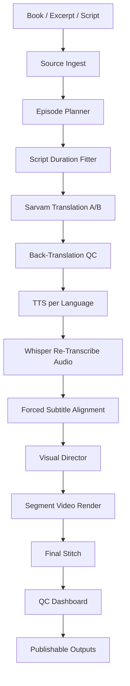

# Forge Plan V2 - Local Story Studio

Created: 2026-05-16

## North Star

Forge should become a local story studio for an M5 Max MacBook:

1. Give it a book, excerpt, or script.
2. It creates a tight video episode, audiobook, subtitles, thumbnails, and translated editions.
3. Hindi and Marathi translation must use local Sarvam.
4. Every output is checked twice before it is considered publishable.
5. The pipeline should take care of itself: resume safely, report what failed, and avoid wasting GPU/Metal heat.

This is not "generate some files." This is a production line with receipts.

## Non-Negotiables

- No cloud dependency for core production.
- Sarvam is the translation engine for Hindi and Marathi.
- No silent success. Every generated artifact gets validation and a QC record.
- Every stage writes resumable artifacts under the output directory.
- Heavy Metal tasks are serialized unless a benchmark proves parallelism is safe.
- Translation, narration, subtitles, visuals, and final muxing are separate cached stages.
- The system must be honest about pronunciation risk, especially Marathi until a native Marathi TTS route exists.

## Current Baseline

Already working:

- `forge episode`: book/text to mini video episode.
- `forge audiobook`: book/text to source and translated audiobook audio.
- Sarvam translation via local Ollama.
- Two-pass translation QC with back-translation.
- English/Hindi/Marathi artifact layout.
- Segment videos, stitched final videos, thumbnails, scripts, subtitles, audio, manifests.
- Doctor verifies Sarvam and `qwen3:8b`.

Current weakness to fix next:

- Subtitles are timed from estimated text chunks, not forced-aligned against final audio.
- Marathi audio falls back to the Hindi macOS `Lekha` voice unless `FORGE_SAY_VOICE_MR` is configured.
- QC is useful but not strict enough to block bad outputs automatically.
- Episode planning can over-write scripts for the target duration, then speed-fit audio as a fallback.
- No review dashboard yet.

## User Workflow V2

### 1. Prepare input

Use a real local book or excerpt:

```sh
mkdir -p ~/Documents/forge-inputs
open -e ~/Documents/forge-inputs/still-water.txt
```

Paste text into that file, then run:

```sh
forge doctor --deep
```

Doctor must show OK for:

- `ffmpeg`
- `ffprobe`
- `mflux-generate`
- `mlx_whisper`
- `ollama`
- `qwen3:8b`
- `hf.co/mradermacher/sarvam-translate-GGUF:Q4_K_M`

### 2. Fast smoke test

Use title-card visuals first. This proves translation, TTS, subtitles, muxing, stitching, and QC without heating up FLUX.
Episode visuals default to four shot-directed stills inside each 15-second segment,
so the final one-minute video is 16 paced image/dialog beats instead of four long
static holds.

```sh
forge episode \
  --book ~/Documents/forge-inputs/still-water.txt \
  --title "Still Water" \
  --preset cinematic \
  --voice male_warm \
  --translate hi,mr \
  --segments 4 \
  --seconds 15 \
  --shots-per-segment 4 \
  --no-flux \
  --out ~/Pictures/still-water-smoke/
```

Inspect:

```sh
open ~/Pictures/still-water-smoke/
cat ~/Pictures/still-water-smoke/qc/episode-qc.json
```

### 3. Production run

Use balanced visuals for a real draft:

```sh
forge episode \
  --book ~/Documents/forge-inputs/still-water.txt \
  --title "Still Water" \
  --preset cinematic \
  --voice male_warm \
  --translate hi,mr \
  --segments 4 \
  --seconds 15 \
  --shots-per-segment 4 \
  --profile balanced \
  --out ~/Pictures/still-water-episode/
```

Use max only after the script, translations, and timings are approved:

```sh
forge episode \
  --book ~/Documents/forge-inputs/still-water.txt \
  --title "Still Water" \
  --preset cinematic \
  --voice male_warm \
  --translate hi,mr \
  --segments 4 \
  --seconds 15 \
  --shots-per-segment 4 \
  --profile max \
  --out ~/Pictures/still-water-final/
```

### 4. Audiobook run

```sh
forge audiobook \
  --book ~/Documents/forge-inputs/still-water.txt \
  --voice male_warm \
  --translate hi,mr \
  --out ~/Music/still-water-audiobook/
```

## Output Contract

Every `forge episode` run should produce:

```text
episode/
  episode-manifest.json
  episode-plan.json
  thumbnail.png
  scripts/
    segment-01.en.txt
    segment-01.hi.txt
    segment-01.mr.txt
  audio/
    raw/
    final/
      segment-01.en.wav
      segment-01.hi.wav
      segment-01.mr.wav
      episode.en.wav
      episode.hi.wav
      episode.mr.wav
  subtitles/
    segment-01.en.srt
    segment-01.hi.srt
    segment-01.mr.srt
  thumbnails/
    segment-01-visual.png
    segment-01.png
  videos/
    segments/
      segment-01.en.mp4
      segment-01.hi.mp4
      segment-01.mr.mp4
    final/
      episode.en.mp4
      episode.hi.mp4
      episode.mr.mp4
  qc/
    episode-qc.json
```

V2 should add:

```text
  review.html
  subtitles/aligned/
  translations/glossary.json
  translations/backtranslations/
  qc/blockers.json
  qc/timing-report.json
  qc/pronunciation-report.json
```

## Architecture V2



## Build Plan

### Phase 1 - Preflight and Real Input UX

Goal: stop bad runs before they start.

Implement:

- `forge episode --check --book ...`
- Validate input path, readable text length, language list, output writability.
- Estimate runtime, disk use, FLUX heat profile, and expected output files.
- Detect missing native Marathi voice and explain fallback clearly.
- Add example input generator:

```sh
forge episode sample --out ~/Documents/forge-inputs/sample.txt
```

Definition of Done:

- A missing book path gives a helpful command to create or select a file.
- A dry run prints a stage-by-stage plan without generating assets.
- All required local models are checked before the first generation step.

### Phase 2 - Script Fitter That Respects Time

Goal: 15 seconds means 15 seconds without ugly speed-up.

Implement:

- Per-language target word budgets.
- Script rewrite loop before TTS.
- Hard max speech-rate gate.
- Do not rely on `atempo > 1.15` except as a warning fallback.
- Store `scripts/revisions/segment-01.en.pass-1.txt`, etc.

Definition of Done:

- 4 x 15 second episode lands within 60s +/- 1s.
- No segment needs speed factor above 1.15 in normal cases.
- QC blocks the run if speed factor exceeds 1.25 unless `--allow-qc-warnings`.

### Phase 3 - Sarvam Translation Studio

Goal: translations should be stable, reviewed, and consistent.

Implement:

- Translation pass A and pass B using Sarvam.
- Back-translation for both passes.
- Translation critic using local `qwen3:8b`.
- Glossary support:

```json
{
  "Still Water": {"hi": "स्थिर जल", "mr": "स्थिर पाणी"},
  "Kaayko": {"hi": "Kaayko", "mr": "Kaayko"}
}
```

- Preserve names, places, chapter terms, and recurring metaphors.
- Placeholder detection, English leakage detection, and repeated-line detection.

Definition of Done:

- `qc/translation-report.json` lists both Sarvam passes, back-translations, selected candidate, and reason.
- Any `<translation>` placeholder or empty line is a hard blocker.
- Glossary terms are enforced across all segments.

### Phase 4 - Native Narration Strategy

Goal: pronunciation should be treated as first-class quality.

Implement:

- Explicit voice routing table:

```json
{
  "en": {"engine": "kokoro", "voice": "am_michael"},
  "hi": {"engine": "say", "voice": "Lekha"},
  "mr": {"engine": "say", "voice": "Lekha", "risk": "fallback"}
}
```

- `FORGE_SAY_VOICE_HI` and `FORGE_SAY_VOICE_MR` overrides.
- Pronunciation lexicon for names and hard words.
- Insert planned pauses using punctuation and silence padding.
- Optional future native Marathi TTS model route when available locally.

Definition of Done:

- QC distinguishes "translation good" from "pronunciation good."
- Marathi outputs are marked publishable only when a native Marathi route is configured or manually approved.
- Pronunciation risk is visible in `review.html` and `qc/pronunciation-report.json`.

### Phase 5 - Forced Alignment and Subtitles That Match Audio

Goal: subtitles should match actual spoken audio, not estimated text timing.

Implement:

- After TTS, run `mlx_whisper` on every final segment audio.
- Compare Whisper transcript to intended script.
- Generate subtitles from aligned audio timing.
- Use intended script text with Whisper timings when similarity is high.
- Fall back to Whisper text when similarity is low and flag QC.

Definition of Done:

- Subtitle start/end times are based on final audio.
- `qc/timing-report.json` includes duration, word count, subtitle count, and transcript similarity.
- Any segment below similarity threshold is flagged for manual review.

### Phase 6 - Visual Director

Goal: visuals should feel like one episode, not four unrelated images.

Implement:

- A visual bible per episode:

```json
{
  "style_anchor": "...",
  "palette": "...",
  "main_subject": "...",
  "world": "...",
  "negative_prompts": ["style drift", "text on image"]
}
```

- Segment prompts inherit the same visual bible.
- Draft mode: `schnell` 4 steps.
- Balanced mode: `dev` 18 steps.
- Final mode: `dev` 25 steps.
- Optional reuse: if visual exists and prompt hash unchanged, do not rerender.

Definition of Done:

- Visual prompts and output hashes are stored in manifest.
- Segment thumbnails share consistent style and subject language.
- Rerunning without changes reuses cached visuals.

### Phase 7 - Final Assembly

Goal: produce publishable editions.

Implement:

- Final videos per language.
- Clean master video with no burned subtitles.
- Soft subtitle tracks where possible.
- Burned subtitle editions for social posting.
- Audiobook outputs:
  - WAV master
  - M4A/AAC compressed version
  - chapter metadata

Definition of Done:

- `videos/final/episode.clean.mp4`
- `videos/final/episode.en.burned.mp4`
- `videos/final/episode.hi.burned.mp4`
- `videos/final/episode.mr.burned.mp4`
- `audio/final/audiobook.en.m4a`, etc.

### Phase 8 - Review Dashboard

Goal: one file tells the truth.

Implement:

- `review.html` with:
  - final videos
  - per-segment audio players
  - source script
  - translations
  - back-translations
  - QC issues
  - thumbnails
  - subtitle preview

Definition of Done:

- User can open `review.html` and approve/reject without reading JSON.
- Each issue links to the exact segment/language artifact.

### Phase 9 - Resume, Repair, and Batch Mode

Goal: the pipeline takes care of itself.

Implement:

- Stage hashes for every input and output.
- `forge episode --resume`
- `forge episode --repair-qc`
- `forge episode --only translations|audio|visuals|mux`
- Batch mode over a folder of books.

Definition of Done:

- Killing a run mid-way leaves no corrupt final artifacts.
- Rerun resumes from the last good cached stage.
- Failed language translation can be repaired without regenerating English video.

## M5 Max Utilization Strategy

Use the hardware like a workstation, not like a furnace.

Metal-heavy:

- FLUX via mflux.
- Whisper via MLX.

CPU / Neural / light:

- Kokoro ONNX TTS.
- macOS `say`.
- ffmpeg encode.

Local LLM:

- Ollama `qwen3:8b`.
- Sarvam translation GGUF.

Rules:

- Keep `metal-heavy` lock at concurrency 1.
- Allow TTS and LLM stages to run outside the Metal lock.
- Use `--no-flux` for pipeline debugging.
- Use `--profile cool` for ideation.
- Use `--profile balanced` for drafts.
- Use `--profile max` only for approved final visuals.
- Add runtime telemetry to QC:
  - seconds per stage
  - estimated GPU-heavy time
  - average segment duration
  - speed-fit factors

## Quality Gates

Hard blockers:

- Missing Sarvam model.
- Empty translation.
- Placeholder translation.
- Missing audio stream.
- Missing video stream.
- Subtitle file missing or empty.
- Segment video duration off by more than 0.5s.
- Final video duration off by more than 1.0s for 4 x 15s.

Warnings:

- Marathi fallback voice used.
- Audio speed factor above 1.15.
- Back-translation length ratio outside 0.65-1.45.
- Whisper similarity below threshold.
- FLUX output reused from cache.

Manual approval required:

- Pronunciation risk.
- Translation critic marks meaning drift.
- Segment script was heavily rewritten to fit duration.

## Immediate Next Implementation Order

1. Add `forge episode --check`.
2. Add strict QC blocker mode and `--allow-qc-warnings`.
3. Add Whisper re-transcription of generated audio.
4. Generate aligned subtitles from actual audio.
5. Add `review.html`.
6. Add glossary support.
7. Add soft subtitle muxing and clean master video.
8. Add resume/repair stage selection.

## V2 Success Test

Run:

```sh
forge episode \
  --book ~/Documents/forge-inputs/still-water.txt \
  --title "Still Water" \
  --preset cinematic \
  --voice male_warm \
  --translate hi,mr \
  --segments 4 \
  --seconds 15 \
  --profile balanced \
  --out ~/Pictures/still-water-v2/
```

Pass criteria:

- `episode.en.mp4`, `episode.hi.mp4`, and `episode.mr.mp4` exist.
- Each final video is 60s +/- 1s.
- Each language has segment audio and subtitles.
- `review.html` opens and shows all artifacts.
- `qc/blockers.json` is empty.
- `qc/episode-qc.json` records two translation passes for Hindi and Marathi.
- Any Marathi pronunciation fallback is clearly marked.
