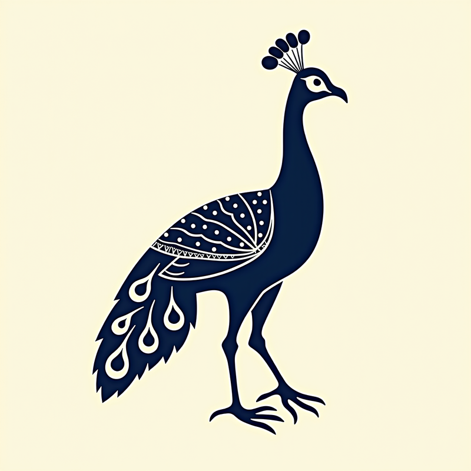
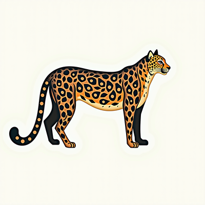
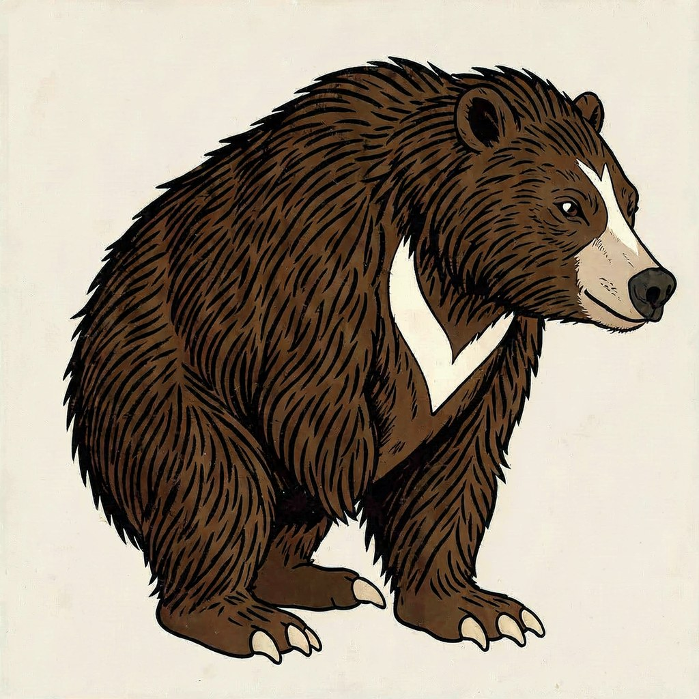
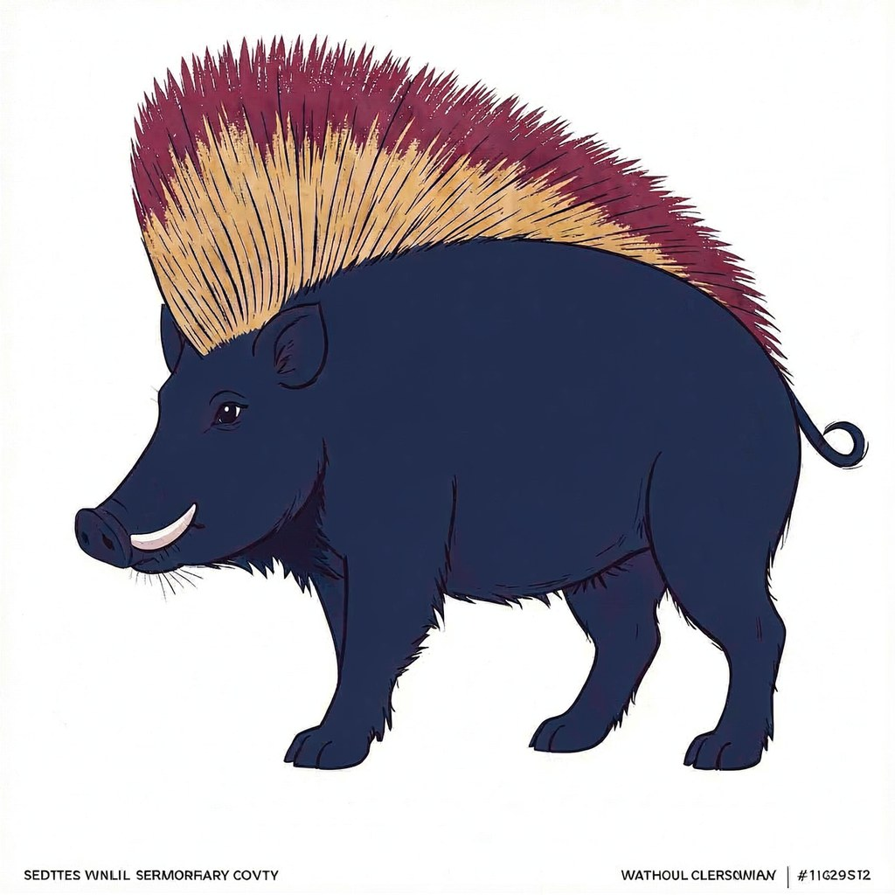
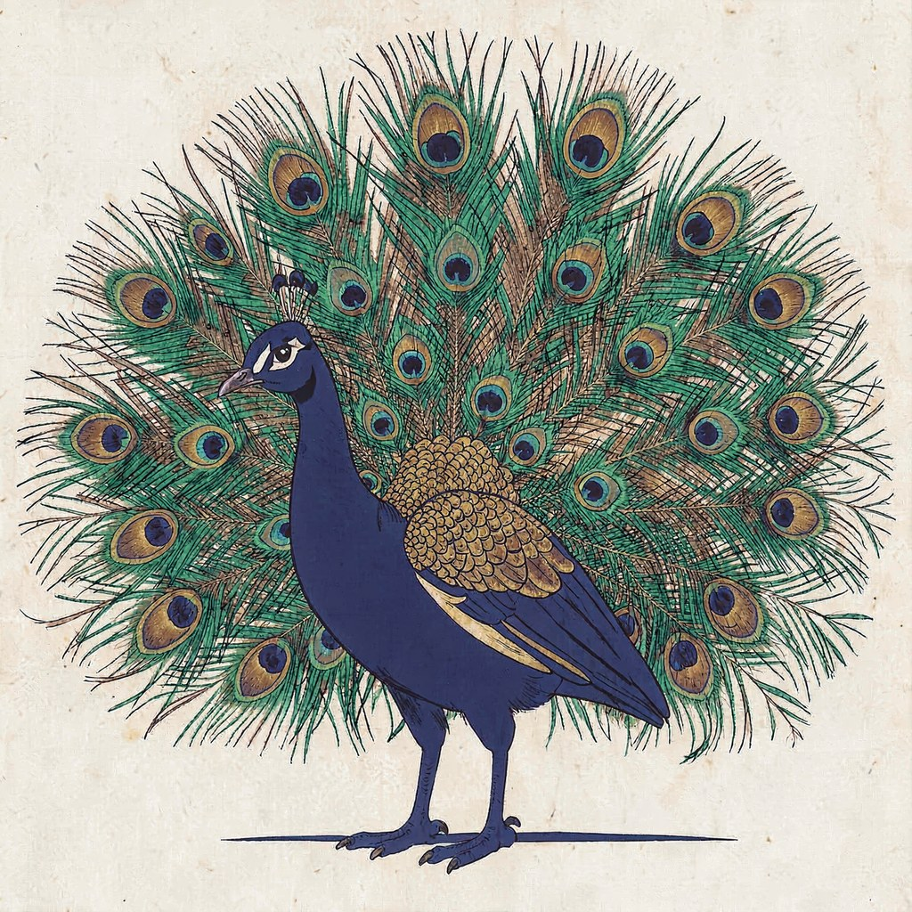
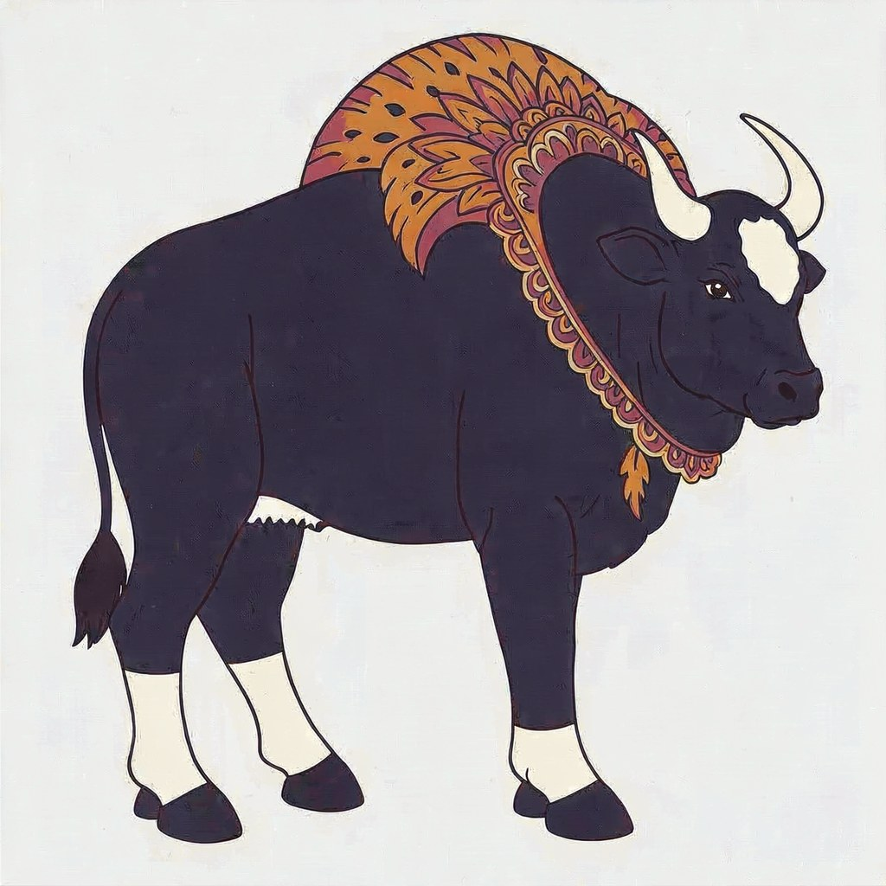
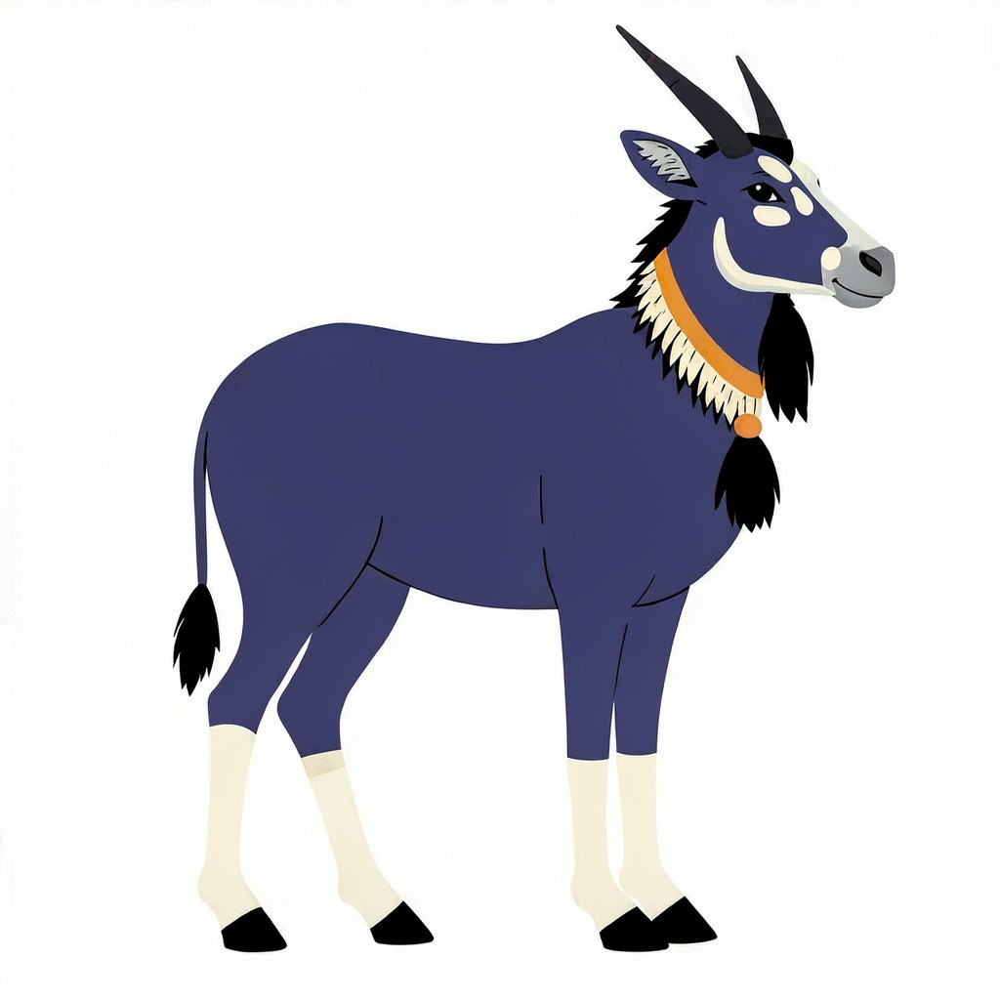
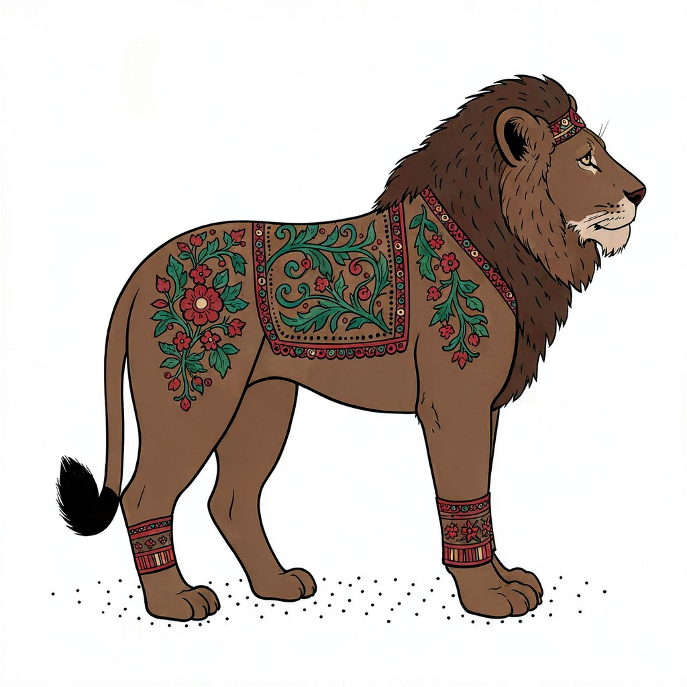

<div align="center">

# Forge

**Local-first generative-AI workstation for Apple Silicon**

*Image · Text · Audio · No cloud required for core local paths*

[](LICENSE)
[](https://github.com/tommyvercetti76/Forge/actions/workflows/tests.yml)
[](#install)
[](#install)
[](NOTICE)
[](CODE_OF_CONDUCT.md)

**`-60.8%`** mflux multi-seed speedup &nbsp;·&nbsp; **`128`** passing tests &nbsp;·&nbsp; **`41`**-species Madhubani catalog &nbsp;·&nbsp; **`F1 0.62`** CLIP probe (LOOCV N=16) &nbsp;·&nbsp; **v1 LoRA = ITERATE** (+0.0357 ΔComp on held-out; below +0.05 ship)

<sub>v1 of the CLIP+sklearn probe collapsed to F1 0.00 on N=16 LOOCV (small-sample artifact, majority-class prediction). v2 — class-balanced LR on the same CLIP features — lifts LOOCV F1 to 0.615. v1 LoRA (25 user-PASS images) returned an ITERATE verdict against a pre-registered +0.05 ship threshold; we publish the verdict + the intermediate failures alongside the methodology. v2 LoRA on the expanded corpus (41 PASS images) is in training; v6 photo-init Kontext-img2img addresses the prior-collision failures (snow-leopard-as-cheetah, cobra-with-two-tongues) that prompt engineering alone couldn't fix. Full accounting: [QC_AGREEMENT_STUDY](docs/QC_AGREEMENT_STUDY.md) · [PAPER_OUTLINE](docs/PAPER_OUTLINE.md).</sub>

[**Install**](#install) &nbsp;·&nbsp; [**Try the gallery**](#specialist-engines) &nbsp;·&nbsp; [**Architecture**](docs/ARCHITECTURE.md) &nbsp;·&nbsp; [**Hard problems**](#hard-problems-forge-solves)

</div>

---

<div align="center">
  
  <br><sub><i>Madhubani folk-art peacock — Forge minimalist-tshirt engine on FLUX.1-dev</i></sub>
</div>

<br>

<div align="center">

**Voted-best by the maintainer** (user-curated `pass_examples/`, also the gold-standard test set for the [auto-QC agreement study](docs/QC_AGREEMENT_STUDY.md))


</div>

<br>

<div align="center">

**Eight species from the 41-render catalog**




<br><sub><i>Eight of 41 species in the Madhubani catalog spanning 21 Indian national parks. Every render ships with a per-asset attribution manifest honoring the Mithila tradition of Bihar, India.</i></sub>

</div>

<br>

<div align="center">

**v5 signature-features uplift** — six species the maintainer marked PASS in v5 (after emphatic <code>species_features.json</code> NON-NEGOTIABLE clauses were added). Each image is the maintainer's actual PASS pick — not the picker's composite winner.







<br><sub><i>Quality is honest-mid — see <a href="docs/FORGE_RESET_2026-05-22.md">FORGE_RESET</a> for the unflinching diagnosis of why prompt+LoRA-only methodology plateaued, and what's next (photo-init Kontext img2img). The picker's composite-best render disagreed with the maintainer's verdict on 4 of 6 species — direct evidence that the composite metric saturates and isn't a substitute for human judgment.</i></sub>

</div>

---

**Forge is an eval-driven local ML workstation for image generation, with domain schemas, automated
QC, model/runtime ops, cultural attribution, and a closed-loop Art Reasoning Engine.**

The flagship is a Madhubani folk-art catalog of 41 Indian-wildlife species across 21 national parks,
rendered entirely on Apple Silicon through FLUX / mflux. Every render is gated by a 9-check QC
rubric before promotion. The project also includes a Translation Studio, eight specialist render
engines, audiobook + video pipelines, and a product-mockup compositor — see
[Other capabilities](#other-capabilities) below.

---

## Benchmarks

> Measured on **M5 Max**, 64GB unified memory.

| Workload | Naïve | Forge | Speedup |
| :--- | ---: | ---: | ---: |
| 4-seed FLUX.1-schnell, 640², `cool` profile | 106.7s | 41.9s | **−60.8%** |
| Same pattern on `quality`/dev (P1 multi-seed) | — | — | **~−15 to −20%** |
| 4-pose Madhubani set, `--jobs 2` parallel poses | 4 waves | 2 waves | **up to −50%** |

Row 1 is the verified P1 multi-seed batch — FLUX cold-load paid once per batch instead of N times.
Rows 2-3 from [QUALITY_FINDINGS](docs/QUALITY_FINDINGS_2026-05-20.md) and
[FORGE_QUALITY_SPEED_AUDIT](docs/FORGE_QUALITY_SPEED_AUDIT_2026-05-19.md). The parallel-pose
figure is the runtime ceiling when memory fits two Metal slots.

<sub>Row 1 is **historical measured evidence** from the P1 multi-seed batch landing (commit
[b618f2c](https://github.com/tommyvercetti76/Forge/commit/b618f2c)). A reproducible
`forge bench --multi-seed` harness is on the roadmap — the existing `forge bench` runs
runtime smoke checks only.</sub>

---

## Hard problems Forge solves

| # | Problem | Solution | Read more |
| :-: | :--- | :--- | :--- |
| 1 | **Photorealism lock on Madhubani folk art** — FLUX.2 rendered photorealistic tigers and peacocks even with "Madhubani" in the prompt. | Flat-silhouette tuning + 18 hard negatives in the engine scaffold. | [MADHUBANI_ART_IDENTITY](docs/MADHUBANI_ART_IDENTITY.md) |
| 2 | **Body-type pose semantics** — "seated peacock" is nonsense; birds don't sit. | Per-body-type pose overrides in `poses.json` v2 — each species inherits only the poses its body plan supports. | [MADHUBANI_ART_IDENTITY](docs/MADHUBANI_ART_IDENTITY.md) |
| 3 | **Trust layer for unattended runs** — naïve QC returns one boolean; you can't tell why a run failed *and* you can't tell if the QC itself is right. | 10-check rubric + `blockers.json` sidecars + `publishable: true/false`. Auto-QC **measured against a maintainer-labeled gold set** of N=16: heuristic rubric F1 **0.53**, CLIP+sklearn probe F1 **0.00 (LOOCV)**. The earlier F1 0.89 claim on N=9 was a small-sample artifact — it does not survive expansion. The measurement methodology is the durable artifact; the numbers will improve as N grows to ≥50. | [madhubani_qc.py](bin/madhubani_qc.py) · [labels_v1.json](brand/madhubani/labels_v1.json) · [QC_AGREEMENT_STUDY](docs/QC_AGREEMENT_STUDY.md) |
| 4 | **Multi-seed wall-clock** — looping `mflux` once per seed pays the Python startup and model load N times. | One `mflux-generate --seed S1 S2 S3 S4` invocation collapses the cold-load tax. **−60.8%** measured on cool/schnell. | [QUALITY_FINDINGS](docs/QUALITY_FINDINGS_2026-05-20.md) |
| 5 | **Cultural-heritage attribution** — generative tools risk extractive use of folk traditions. | 50 open-licensed Wikimedia references with `attribution.json` receipts per asset + a dedicated heritage doc. | [CULTURAL_HERITAGE](docs/CULTURAL_HERITAGE_ATTRIBUTION.md) · [references/](brand/references/README.md) |
| 6 | **Closed-loop verification** — prompt iteration hits a context ceiling and you can't tell whether the next change is helping. | Art Reasoning Engine that auto-checks renders against rubric items. **Shipped:** pattern-density (B.1), decoration-zone-presence (B.2), anatomy-count (B.3), composite best-of-N picker (C.1), retry-with-targeted-boost loop (C.2). Full pipeline exercised end-to-end on the rhino species — picker ranks v3 baseline at composite 0.8207 over v1 mascot at 0.7056; engine proposes the right palette-fix boost for the loser. **Planned:** D.1+D.2 feedback memory. | [ART_REASONING_ENGINE](docs/ART_REASONING_ENGINE.md) · [RHINO_E2E_TEST](docs/RHINO_E2E_TEST_2026-05-20.md) · [art_reasoning_engine.py](bin/art_reasoning_engine.py) · [best_of_n.py](bin/best_of_n.py) |
| 7 | **Inference-only is not ML** — calling someone else's checkpoint is a step short of training. | Pilot LoRA shipped: 50-image Mithila corpus → `mflux-train` on `z-image-turbo` with auto-derived captions, 4-bit quantization. **Pilot completed in 9 min 31 s on M5 Max**; visible style transfer from photoreal to ink-line folk-art between step 0 and step 50 (see [pilot gallery](docs/gallery/lora_pilot/)). Full overnight recipe (~15 hrs at 768 px) documented. | [LORA_TRAINING_RECIPE](docs/LORA_TRAINING_RECIPE.md) · [forge_madhubani_lora.py](bin/forge_madhubani_lora.py) |
| 8 | **Translation without a measurement gate is unverifiable** — round-trip QC, subtitle alignment, punctuation restore, and TTS comparisons need a ground-truth baseline. | T1/T2 agreement study: 20 aligned EN/HI/MR paragraphs through the production Sarvam Ollama path, measured with SacreBLEU. Headline: **BLEU 47.25 EN→HI**, **28.97 EN→MR**, round-trip **69.70 EN→HI→EN**, **65.25 EN→MR→EN**; direct MR→EN reference translation is exposed as unstable (**BLEU 0.21**) rather than papered over. | [translate_agreement_study.py](bin/translate_agreement_study.py) · [TRANSLATION_AGREEMENT_STUDY](docs/TRANSLATION_AGREEMENT_STUDY.md) |
| 9 | **"ASMR" is usually a vibe word** — without acoustic targets, audiobook quality cannot be verified or improved. | Four numeric ASMR presets now define speaking-rate bands, breath gaps, LUFS, true-peak, and EQ profile. Audiobook renders can emit per-language receipts with target/measured WPM, target/measured LUFS, peak, and drift pass/fail. | [asmr_presets.json](brand/translate/asmr_presets.json) · [audiobook.py](bin/audiobook.py) |

---

<details>
<summary><b>Reality check</b> — what Forge is and is not (click to expand)</summary>

<br>

- **Local-first, not local-only.** Most image, LLM, translation, and English TTS workflows run
  locally after setup. High-quality Hindi and Marathi TTS can optionally use Sarvam Bulbul through
  `SARVAM_TTS_KEY`.
- **Apple Silicon only.** Performance profile assumes an M-series machine with enough unified
  memory for FLUX workloads.
- **FLUX rendering depends on `mflux` and cached model weights.** `forge doctor --deep` is the
  first thing to run when renders behave strangely.
- **Two audiobook surfaces.** `forge audiobook` is the general CLI wrapper.
  `bin/audiobook.py` is the deeper multilingual ASMR/book-video pipeline.
- **Full-page audiobook coverage is supported in `bin/audiobook.py`.** Batch mode now defaults to
  complete page-window narration; use `--spoken-words N` or `--coverage excerpt` only when you
  intentionally want an excerpt. Remaining audiobook audit gaps live in
  [docs/BOOK_LOCALIZATION_AUDIT_HANDOFF.md](docs/BOOK_LOCALIZATION_AUDIT_HANDOFF.md).

</details>

---

## The ML contribution

A closed feedback loop where **human grading drives LoRA training**, with the verdict
(`SHIP` / `ITERATE` / `SHELVE`) measured against held-out species via paired ΔComposite
scoring. We **pre-register thresholds**, **publish intermediate failures**, and **ship
the negative-result data alongside the working pipeline**.

| Iteration | Verdict | What landed |
|---|---|---|
| **v1 LoRA** | `ITERATE` | +0.0357 mean ΔComposite on held-out species (rhino · peacock · elephant · snow-leopard) at scale 0.75. **Below** our pre-registered +0.05 ship threshold. Documented as a negative result. |
| **v5 batch** (signature-features) | mixed | +41% PASS rate vs v4 (29 → 41 PASS) but anatomy_broken regressions UP by 7. Six priority species moved 0→1 PASS; cobra · snow-leopard · tiger remained 0/N PASS. |
| **v2 LoRA** | training now | 41 user-PASS images (v1 was 25). Class-balanced corpus, rank-16 cross-attention LoRA on z-image-turbo (Apache-2.0, commercially licensable). |
| **v6 photo-init** | pipeline ready | Kontext-img2img with per-species reference photos as anatomy anchors. Addresses prior-collision failures (snow-leopard-as-cheetah, cobra-with-two-tongues) that prompt engineering alone couldn't resolve. |

### Receipts you can verify

Every rendered artifact ships with a **SHA-256 chain**: model weights → LoRA adapter →
prompt hash → init image → license attribution. Every training image is open-license
(strict CC-BY/SA/CC0/PD; **0 CC-BY-NC**). Every fact in the species knowledge base
cites an open-access paper (76+ citations across IUCN, PLOS, BMC, PMC).

[ML methodology](docs/ART_REASONING_ENGINE.md) · [QC agreement study](docs/QC_AGREEMENT_STUDY.md) · [Receipt schema](docs/SCHEMA.md) · [Paper outline](docs/PAPER_OUTLINE.md) · [Knowledge base](brand/madhubani/kb/INDEX.md)

---

## Other capabilities

The Madhubani engine is the flagship, but Forge ships a wider production toolkit. These all run
locally on Apple Silicon and share the same trust-layer / artifact-receipt conventions.

| Area | Primary entrypoints | Output |
| --- | --- | --- |
| Web console | `forge web` | Browser wizard, run console, galleries, form-driven generation |
| Brand thumbnails | `forge thumbnail`, `forge brief` | PNG thumbnails, background generations, title/metadata kits |
| Specialist image engines | `forge engine ...` | FLUX renders plus directive JSON and gallery metadata |
| Product mockups | `forge mockup ...` | Download/scaffold product templates and batch storefront mockups |
| Image editing | `forge edit` | Edited variants from an existing image |
| High-res via upscaler | `forge engine render ... --upscale {2x,3x,4x,6x,8x,12x,16x}` | RealESRGAN-ncnn-vulkan post-render upscale, safe on M5 Max |
| Procedural art | `forge mandala`, `forge childrens-book`, `forge folk-art`, `forge minimal-animal` | SVG/PNG line art and QC JSON |
| Voiceover | `forge voice`, `forge setup-voices` | English audio plus translated sidecars |
| Episodes | `forge episode` | Mini-segment videos, scripts, stills, subtitles, QC manifests |
| Audiobooks | `forge audiobook`, `bin/audiobook.py` | Chunked narration, translations, subtitles, optional video mux |
| Video prep | `process-video warmup`, `process-video process` | Transcripts, captions, overlays, thumbnails, final MP4 |
| WhatsApp joke factory | `bin/whatsapp_joke_factory.py` | Share-ready joke packs for Indian audiences over 60, with QC + manifest |
| Ops | `forge doctor`, `forge status`, `forge models`, `forge bench` | Runtime checks, job state, model inventory, profiles |

## Specialist Engines

Each engine declares its native canvas — typing `forge engine render <name>` without `--width`/`--height` uses the genre's natural aspect.

| Engine | Native canvas | Register |
| --- | --- | --- |
| `childrens-coloring-book` | 1024×1280 portrait (4:5) | Bold B&W ink line art, 8.5×11 coloring page |
| `mandala-art` | 1280×1280 square (1:1) | Radial mandalas with subject at center |
| `indian-classical` | 1024×1280 portrait (4:5) | Madhubani / Warli / Tanjore / Pahari / Ravi-Varma |
| `impressionist` | 1280×960 landscape (4:3) | Monet / Renoir / Seurat / Van Gogh painterly |
| `noir-cinema` | 1280×720 widescreen (16:9) | Roger Deakins / Gordon Willis film stills |
| `wildlife-photo` | 1280×720 widescreen (16:9) | Nat Geo / BBC Earth editorial framing |
| `stylized-cinematic` | 1280×720 widescreen (16:9) | Tartakovsky / Mignola / McQuarrie / Ghibli |
| `minimalist-tshirt` | 1280×1280 square (1:1) | Screen-printable apparel graphics ([docs/MINIMALIST_TSHIRT_ENGINE.md](docs/MINIMALIST_TSHIRT_ENGINE.md)) |

Beta minimalist line-art lane: `forge minimal-animal --animal "alert tiger in
side profile" --max-lines 8` emits a construction-guaranteed SVG/PNG mark plus
QC and manifest. See [docs/MINIMAL_ANIMAL_LINES.md](docs/MINIMAL_ANIMAL_LINES.md).

Resolution priority chain: `--ultra-res` > `--hi-res` > explicit `--width`/`--height` > engine native canvas > 1280×720 fallback. The upscale path (next section) is the safest route to print-grade resolution on M5 Max.

Every `forge engine render` checks for a `<png>.qc.json` sidecar after each
render. Failed checks become a `<png>.blockers.json` sibling and the manifest
records `publishable: false` for that variant. The default is strict; pass
`--allow-qc-warnings` to keep the blockers list visible while forcing
`publishable: true` (use only after human review). Today only Madhubani
writes rich QC sidecars (4/7 rubric checks gated); other engines emit no
blockers until per-engine auto-QC lands. The Madhubani driver applies the
same gate at promotion time (`promote_pose` still honors `--force`). The
shared primitive lives in [bin/engine_qc.py](bin/engine_qc.py).

## Repository Map

```text
Forge/
|-- README.md                         # this front door
|-- SKILL.md                          # mental model for choosing Forge tools
|-- PLAN.md                           # future work using existing local models
|-- PLAN_V2.md                        # local story-studio north star
|-- ALIGNMENT_PLAN.md                 # gap review and execution plan
|-- AUDIT.md                          # output correctness audit
|-- BACKLOG.md                        # feature backlog
|-- BRAND-LORA.md                     # brand LoRA training and install guide
|-- bin/
|   |-- forge.py                      # main CLI
|   |-- forge_web.py                  # local browser UI
|   |-- forge_runtime.py              # cache, jobs, locks, LLM/TTS helpers
|   |-- style_engines.py              # specialist FLUX engines
|   |-- _engine_base.py               # engine contracts
|   |-- engine_qc.py                  # shared blockers/publishable trust layer
|   |-- mandala_engine.py             # procedural mandala/line-art renderer
|   |-- minimal_animal_engine.py      # beta <=8-line animal mark renderer
|   |-- audiobook.py                  # multilingual book/video pipeline
|   |-- process-video.py              # upload-ready video prep pipeline
|   |-- migrate-models.sh             # adopt model files into ~/Models
|   `-- watch-folder.sh               # folder watcher for video prep
|-- brand/
|   |-- presets/                      # thumbnail/image brand presets
|   |-- prompts/library.json          # reusable engine recipes
|   |-- loras/README.md               # LoRA install notes
|   |-- references/README.md          # brand/reference source notes
|   `-- voices.json                   # voice preset registry
|-- docs/                             # architecture, audits, handoffs, contracts
|-- series/                           # consistency locks for recurring worlds
|-- system/                           # launchd watcher plist
|-- tests/                            # runtime regression tests
`-- archive/                          # older scripts kept for reference
```

---

## Install

From this repo:

```sh
cd ~/Desktop/Forge
chmod +x bin/*.py bin/*.sh

mkdir -p ~/.local/bin
ln -sf ~/Desktop/Forge/bin/forge.py ~/.local/bin/forge
ln -sf ~/Desktop/Forge/bin/process-video.py ~/.local/bin/process-video
```

Make sure `~/.local/bin` is on your shell path:

```sh
echo 'export PATH="$HOME/.local/bin:$PATH"' >> ~/.zprofile
source ~/.zprofile
```

Run the first checks:

```sh
forge list
forge doctor --deep
forge models scan
```

For video work, warm the video pipeline once:

```sh
process-video warmup
```

## Start The Web UI

```sh
forge web --host 127.0.0.1 --port 5002
```

Use `--no-open` if you only want the server:

```sh
forge web --host 127.0.0.1 --port 5002 --no-open
```

Four concurrent FLUX slots on a 128 GB Apple Silicon machine:

```sh
forge web --host 127.0.0.1 --port 5002 --metal-slots 4
```

The web UI is a control surface over the same CLI/runtime. When a web option
seems suspicious, confirm against the matching CLI help and the audit docs.

The web UI has been decluttered into 6 top-level areas:
**GALLERY · CREATE · EDIT · PIPELINES · LIBRARY · SYSTEM**.

The **Create** page is a unified surface — pick a Style (children's coloring /
mandala / Indian folk / stylized cinematic) and the engine-specific dropdowns
auto-swap in the "Style details" drawer. Every form leads with the daily-driver
controls (prompt, recipe, source image, render mode, final size, seed,
variants). Advanced controls (guidance, refine, quantize, LoRA stack, custom
width/height) live in closed `<details>` drawers — reachable, not in the way.
Kontext-incompatible controls auto-dim when a source image is uploaded.

## Daily Commands

### Inspect The System

```sh
forge doctor --deep
forge status
forge models scan --full
forge bench
```

### Render A Thumbnail

```sh
forge thumbnail \
  --preset tartakovsky \
  --concept "lone paddler at sunrise on an alpine lake, cinematic golden hour" \
  --headline "WHY I PADDLE ALONE" \
  --sub "what 200 lakes taught me" \
  --profile balanced \
  --seed 1 \
  --out ~/Pictures/podcast-thumb.png
```

Use an existing image as the background:

```sh
forge thumbnail \
  --preset thumbnail-bold \
  --bg ~/Pictures/frame.png \
  --headline "THE QUIET PART" \
  --sub "a field note" \
  --out ~/Pictures/thumb-from-frame.png
```

### Render With A Specialist Engine

```sh
forge engine list
forge engine recipes
forge engine describe wildlife-photo

forge engine render wildlife-photo \
  --subject "a tiger crossing a shallow forest stream at dawn" \
  --profile balanced \
  --seed 7 \
  --out ~/Pictures/wildlife-tiger.png
```

### Render An 8-Line Minimal Animal Mark

```sh
forge minimal-animal \
  --animal "alert tiger in side profile with a long tail" \
  --max-lines 8 \
  --out ~/Pictures/tiger-eight-line.png
```

Forge writes `.png`, `.svg`, `.qc.json`, and `.manifest.json`. The SVG stroke
count is the source of truth; the PNG is only the preview.

### Create Product Mockups

Download 50 open-license SVG product templates with credit receipts:

```sh
forge mockup open-svg \
  --out generated/mockup_templates/open-svg \
  --limit 50
```

Create one SVG mockup from a transparent print-art PNG:

```sh
forge mockup create \
  --design generated/madhubani_animals/_legacy/indian_animals_v3/01_royal_bengal_tiger_madhubani_tshirt.transparent.png \
  --manifest generated/mockup_templates/open-svg/templates.json \
  --template-id mdi-tshirt-crew-outline \
  --out generated/mockups/tiger/tiger-crew-tee.svg
```

Fan one or more transparent designs across every downloaded SVG template:

```sh
forge mockup batch \
  --design-dir generated/madhubani_animals/_legacy/indian_animals_v3 \
  --pattern "01_royal_bengal_tiger_madhubani_tshirt.transparent.png" \
  --manifest generated/mockup_templates/open-svg/templates.json \
  --out generated/mockups/tiger_50_open_svg
```

Forge writes one `.svg` mockup and one `.svg.attribution.json` receipt per
template. Direct image/SVG templates or GitHub blob URLs are still supported
when you have your own licensed files:

```sh
forge mockup download \
  https://github.com/owner/repo/blob/main/mockups/front.png \
  --out generated/mockup_templates/downloads
```

`forge mockup init` remains available as an offline procedural fallback, but the
sourceable path for production review is `forge mockup open-svg`.

### High Resolution — The Upscale Path

Native ultra-res FLUX (`--ultra-res` at 2048×1152) over-subscribes Metal memory
on M5 Max when combined with `--from-image` (Kontext). The safer, faster path to
print-grade resolution is **render small, upscale via RealESRGAN-ncnn-vulkan**:

```sh
# 1024×1280 base render + 4× upscale → 4096×5120 final (~21 MP)
forge engine render childrens-coloring-book \
  --subject "a friendly bear cub holding a balloon" \
  --upscale 4x

# 1280×1280 base + 8× upscale → 10240×10240 final (~105 MP), chained 4×→2×
forge engine render mandala-art \
  --subject "an elephant facing forward, body filled with Madhubani patterns" \
  --upscale 8x
```

Available factors: `2x` `3x` `4x` `6x` `8x` `12x` `16x`. Non-native factors
(6/8/12/16) chain two passes. Each pass is ~6 seconds.

Pre-flight checks before any heavy mflux launch — refuses to start if
`<20 GB` free RAM (override via `FORGE_MFLUX_MIN_FREE_GB=10`). Kontext/img2img
renders are auto-clamped to ≤1280×720 because the combination with `--from-image`
oversubscribes Metal; pair Kontext with `--upscale` for the high-res final.

### Render Procedural Line Art

These engines do not use diffusion. They write deterministic SVG/PNG assets.

```sh
forge mandala \
  --style floral \
  --symmetry 24 \
  --rings 9 \
  --complexity max \
  --width 2400 \
  --height 2400 \
  --seed 45 \
  --out ~/Pictures/mandalas/floral-24.png

forge childrens-book \
  --theme all \
  --pages 3 \
  --symmetry 12 \
  --rings 7 \
  --complexity max \
  --out ~/Pictures/symmetric-childrens-book/

forge folk-art \
  --theme buddha-peacock \
  --width 2400 \
  --height 1800 \
  --stroke-width 3 \
  --out ~/Pictures/folk-art/buddha-peacock.png
```

### Create Voiceover

```sh
forge setup-voices --kokoro

forge voice \
  --preset male_warm \
  --text "Welcome back. Today we are talking about still water and memory." \
  --out ~/Sounds/intro.wav
```

Translated sidecars:

```sh
forge voice \
  --preset male_warm \
  --text "Welcome back." \
  --translate hi,mr \
  --out ~/Sounds/intro.wav
```

English defaults to Kokoro when installed, then macOS `say` as fallback. Indic
audio is best with Sarvam:

```sh
export SARVAM_TTS_KEY="sk_..."
```

### Build A Brief

```sh
forge brief \
  --topic "I paddled solo across 200 lakes and this is what changed" \
  --preset tartakovsky \
  --voice male_warm \
  --profile balanced \
  --out ~/Pictures/episode-05/
```

Expected bundle:

```text
episode-05/
|-- metadata/
|-- thumbnails/
|-- voiceover-intro.wav
`-- brief.json
```

### Build A Mini Episode

```sh
forge episode \
  --book ~/Documents/book-excerpt.txt \
  --title "Still Water" \
  --preset cinematic \
  --voice male_warm \
  --translate hi,mr \
  --segments 4 \
  --seconds 15 \
  --shots-per-segment 4 \
  --profile balanced \
  --out ~/Pictures/still-water-episode/
```

Use `--no-flux` when you want title-card visuals instead of generated stills:

```sh
forge episode --book ~/Documents/book.txt --no-flux --out ~/Pictures/episode/
```

### Build Audiobook Assets

General Forge wrapper:

```sh
forge audiobook \
  --book ~/Documents/book.txt \
  --voice male_warm \
  --translate hi,mr \
  --out ~/Music/book-audiobook/
```

Deeper multilingual book/video pipeline:

```sh
python3 bin/audiobook.py \
  --rtf ~/Documents/book.rtf \
  --video ~/Movies/loop.mp4 \
  --out-dir ~/Movies/book-output \
  --langs en,hi,mr \
  --batch-pages 10 \
  --page-words 250 \
  --full-page \
  --asmr-preset calm-explainer \
  --subtitles srt
```

For a short demo excerpt instead of complete page coverage, pass
`--coverage excerpt --spoken-words 150`. Every run writes a manifest coverage
receipt with source words, narrated words, and coverage ratio. Subtitle sidecars
use the approved translated text as canonical content and Whisper word timings
only for alignment; `--subtitles vtt` writes a real `WEBVTT` file.

### Process A Video

```sh
process-video process ~/Videos/clip.mp4 --quality good --noisy
process-video process ~/Videos/clip.mp4 --quality balanced --captions en,hi,mr
```

Folder watcher:

```sh
bash ~/Desktop/Forge/bin/watch-folder.sh ~/Videos/videos-in ~/Videos/videos-out
```

---

## Resource Profiles

Profiles are the shared speed/quality vocabulary across CLI and web UI.

| Profile | FLUX model | Steps | Guidance | Cooldown | Intended use |
| --- | --- | ---: | ---: | ---: | --- |
| `cool` | `schnell` | 4 | 0.0 | 20s | Preview/scouting pass, fastest and lowest heat |
| `balanced` | `dev` | 18 | preset/default | 0s | Default production iteration |
| `max` | `dev` | 25 | preset/default | 0s | Better final detail when time allows |
| `quality` | `dev` | 36 | preset/default | 0s | Production-grade q8 path for line art/iconic work |

Resolution, step count, and model choice dominate speed. Quantization helps with
memory pressure, but it is not the main speed lever on Apple Silicon.

Parallel FLUX renders are opt-in. Set `FORGE_METAL_SLOTS=4` or
`FORGE_FLUX_PARALLEL_JOBS=4` before starting `forge web` or launching CLI
batches to request four simultaneous `metal-heavy` workers. Forge caps that
request by total unified memory (`FORGE_METAL_SLOT_RAM_GB`, default 24 GB per
slot) and runs the free-memory preflight after acquiring a slot. Keep
`quality`/q8 or explicit `--quantize 8`; fp16 (`--quantize 0`) is intentionally
manual because multiple fp16 FLUX-dev jobs can overrun unified memory and
throttle hard.

Madhubani set renders can request parallel pose workers directly:

```sh
python bin/forge_madhubani.py render tiger --all-poses --jobs 2
```

On a four-pose set, two jobs can cut ideal wall clock roughly in half when two
Metal slots fit in memory. The runtime still serializes or caps work if the
machine cannot safely hold it.

Multi-seed engine renders collapse into a single mflux invocation. When
`forge engine render <engine> --seeds N` is used, Forge passes all seeds to
one `mflux-generate --seed S1 S2 ...` call instead of spawning N
subprocesses. Measured −60.8% wall-clock on a 4-seed cool/schnell run
(106.7 s → 41.9 s) because the FLUX cold-load is paid once per batch. The
saving is largest on `cool`/`schnell` scouting and smaller (~15–20%) on
`quality`/`max` where inference dominates. See
[docs/QUALITY_FINDINGS_2026-05-20.md](docs/QUALITY_FINDINGS_2026-05-20.md).

Common pattern:

```sh
# Scout
forge engine render wildlife-photo --subject "..." --profile cool

# Candidate
forge engine render wildlife-photo --subject "..." --profile balanced

# Final
forge engine render wildlife-photo --subject "..." --profile quality
```

## Canonical Model Home

Forge expects model-shaped files under `~/Models/`.

```text
~/Models/
|-- ollama/           # Ollama GGUF models
|-- huggingface/      # Hugging Face cache used by mflux, mlx_whisper, etc.
|-- flux-bfl/         # raw BFL-format FLUX checkpoints
`-- kokoro/           # Kokoro TTS model files
```

Adopt or inventory models:

```sh
bash ~/Desktop/Forge/bin/migrate-models.sh
bash ~/Desktop/Forge/bin/migrate-models.sh --yes

forge models scan --full
forge models adopt ~/Downloads/model.safetensors --as flux-bfl
forge models clean --dry-run
```

## Important Environment Variables

| Variable | Purpose |
| --- | --- |
| `FORGE_HOME` | Override repo root discovery |
| `FORGE_MODELS_HOME` | Override `~/Models` |
| `FORGE_HF_HOME` | Override Hugging Face cache path |
| `FORGE_STATE_HOME` | Override `~/.forge` state, jobs, locks, web runs |
| `FORGE_OLLAMA_URL` | Ollama endpoint, default `http://localhost:11434` |
| `FORGE_OLLAMA_MODEL` | Local LLM model, default `qwen3:8b` |
| `FORGE_TRANSLATE_MODEL` | Local translation model |
| `FORGE_TOKEN_USAGE` | `0` disables token usage logs |
| `FORGE_TTS_ENGINE` | `auto`, `kokoro`, or `say` |
| `FORGE_AUDIO_LANGS` | Default translation languages for voice/brief |
| `SARVAM_TTS_KEY` | Enables Sarvam cloud TTS for Indic languages |
| `FORGE_SARVAM_SPEAKER` | Default Sarvam speaker |
| `FORGE_SARVAM_SPEAKER_MR` | Marathi-specific Sarvam speaker override |
| `FORGE_SARVAM_MODEL` | Sarvam model, default `bulbul:v3` |
| `FORGE_FLUX_QUANTIZE` | mflux weight quantization, default `4`; use `8` for higher-fidelity finals, `0` for fp16 |
| `FORGE_METAL_SLOTS` | Requested concurrent heavy Metal workers; default `1`, capped by memory |
| `FORGE_FLUX_PARALLEL_JOBS` | Alias for `FORGE_METAL_SLOTS` focused on FLUX render batches |
| `FORGE_METAL_MAX_SLOTS` | Hard cap for `metal-heavy` slots after env request |
| `FORGE_METAL_SLOT_RAM_GB` | Memory budget per heavy Metal slot, default `24` |
| `FORGE_MADHUBANI_JOBS` | Default parallel pose workers for `bin/forge_madhubani.py render`; equivalent to `--jobs` |
| `FORGE_MFLUX_MIN_FREE_GB` | Free-memory guard before heavy FLUX renders |
| `FORGE_MLX_CACHE_LIMIT_GB` | MLX/HF cache cleanup target |
| `FORGE_ALLOW_CPU_ML` | Emergency override for Metal guard; unset by default so FLUX refuses CPU-only ML paths |
| `FORGE_ALLOW_TEMP_ARTIFACT_FALLBACK` | Explicit emergency opt-in to redirect unwritable artifact receipts to temp; default is fail loudly |
| `FORGE_CAPTION_LANGS` | Default caption languages for `process-video` |

---

## Documentation Map

Start here:

| Document | Use it when |
| --- | --- |
| [docs/INDEX.md](docs/INDEX.md) | You need the complete docs inventory |
| [SKILL.md](SKILL.md) | You need to choose the right Forge command/tool |
| [docs/FEATURES.md](docs/FEATURES.md) | You need current feature inventory and limits |
| [docs/ARCHITECTURE.md](docs/ARCHITECTURE.md) | You need system/data-flow diagrams |
| [docs/MINIMALIST_TSHIRT_ENGINE.md](docs/MINIMALIST_TSHIRT_ENGINE.md) | You are rendering minimalist screen-printable T-shirt graphics |
| [docs/MINIMAL_ANIMAL_LINES.md](docs/MINIMAL_ANIMAL_LINES.md) | You are exploring exact <=8-line animal marks |

Critical handoffs and audits:

| Document | Use it when |
| --- | --- |
| [docs/FORGE_QUALITY_SPEED_AUDIT_2026-05-19.md](docs/FORGE_QUALITY_SPEED_AUDIT_2026-05-19.md) | You are checking the prior quality/speed audit and target math |
| [docs/QUALITY_FINDINGS_2026-05-20.md](docs/QUALITY_FINDINGS_2026-05-20.md) | You are deciding the next quality/perf lever — measured P1/Q1 results, levers A–F, per-species iconography draft |
| [docs/BOOK_LOCALIZATION_AUDIT_HANDOFF.md](docs/BOOK_LOCALIZATION_AUDIT_HANDOFF.md) | You are building near-perfect Hindi/English/Marathi book subtitles and audio |
| [docs/PRESET_PRECISION_IMPROVEMENT_HANDOFF.md](docs/PRESET_PRECISION_IMPROVEMENT_HANDOFF.md) | You are improving preset precision by 40% or more |
| [docs/PRESET_PROMPT_TEMPLATE.md](docs/PRESET_PROMPT_TEMPLATE.md) | You are authoring semantic preset tokens and dependency vectors |
| [docs/WHATSAPP_JOKE_FACTORY_HANDOFF.md](docs/WHATSAPP_JOKE_FACTORY_HANDOFF.md) | You are building a safe WhatsApp joke factory for Indian audiences over 60 |
| [docs/AUDIOBOOK_API.md](docs/AUDIOBOOK_API.md) | You are changing audiobook public API or output contracts |
| [docs/AUDIOBOOK_HANDOFF.md](docs/AUDIOBOOK_HANDOFF.md) | You are refactoring audiobook quality end to end |
| [docs/COLORING_BOOK_SCIENCE.md](docs/COLORING_BOOK_SCIENCE.md) | You are tuning coloring-book/image prompt science |
| [AUDIT.md](AUDIT.md) | You are validating output correctness invariants |

Planning and execution:

| Document | Use it when |
| --- | --- |
| [PLAN.md](PLAN.md) | You need the practical future-work list |
| [PLAN_V2.md](PLAN_V2.md) | You need the local story-studio north star |
| [ALIGNMENT_PLAN.md](ALIGNMENT_PLAN.md) | You need the gap-to-vision execution plan |
| [BACKLOG.md](BACKLOG.md) | You need queued feature work |
| [docs/FORGE_PORTFOLIO_PLAN.md](docs/FORGE_PORTFOLIO_PLAN.md) | You need the 5-lane portfolio-grade plan |
| [docs/ROADMAP.md](docs/ROADMAP.md) | You need the public shipped / in-progress / next ledger |

Documentation maintenance:

| Document | Use it when |
| --- | --- |
| [docs/DOCUMENTATION_PROTOCOL.md](docs/DOCUMENTATION_PROTOCOL.md) | You are adding or changing a feature |
| [docs/FEATURE_TEMPLATE.md](docs/FEATURE_TEMPLATE.md) | You need the template for a new feature doc |
| [BRAND-LORA.md](BRAND-LORA.md) | You are training/installing a brand LoRA |
| [brand/loras/README.md](brand/loras/README.md) | You are installing LoRA files |
| [brand/references/README.md](brand/references/README.md) | You are managing brand/reference source images |

## Development And Verification

Docs-only changes usually need link review, not the full media stack. Runtime
changes should run at least:

```sh
python3 -m unittest tests.test_runtime
python3 -m py_compile bin/forge.py bin/forge_web.py bin/forge_runtime.py bin/mandala_engine.py bin/process-video.py bin/audiobook.py
```

Before declaring a media change done:

```sh
forge doctor --deep
forge status
forge models scan --full
```

For UI changes, run:

```sh
forge web --host 127.0.0.1 --port 5002
```

Then verify that the web form sends only options the backend actually consumes.
The current audit lens for this kind of mismatch is captured in the handoff docs
and should be updated whenever the UI changes.

---

## Known Sharp Edges

- Full book localization needs forced alignment, glossary enforcement,
  bilingual QA, coverage metrics, and subtitle timing gates before it can be
  called near-perfect.
- The web UI is powerful but easier to clutter than the CLI. Prefer fewer visible
  controls, sensible presets, progressive disclosure, and audited mapping from
  UI fields to backend settings.
- Native high-resolution FLUX can oversubscribe Metal memory. Prefer safe base
  renders plus external upscaling unless a workflow has been tested.
- Subtitles should default to SRT for video platforms unless a target workflow
  specifically requires VTT.
- Cloud TTS requires explicit credentials and should be documented as such in
  every workflow that depends on it.

## Documentation Rule

A feature is not done until the repo says what exists, what it outputs, what can
go wrong, how to verify it, and where future agents should continue. Update
[docs/INDEX.md](docs/INDEX.md) whenever you add a durable doc.

---

<div align="center">

**Forge** is a personal portfolio project by [Rohan Ramekar](https://github.com/tommyvercetti76).

Built on [`mflux`](https://github.com/filipstrand/mflux), [FLUX](https://blackforestlabs.ai/) (BFL non-commercial), and [Z-Image-Turbo](https://huggingface.co/).
Cultural attribution: see [docs/CULTURAL_HERITAGE_ATTRIBUTION.md](docs/CULTURAL_HERITAGE_ATTRIBUTION.md).

[**Install**](#install) · [**Roadmap**](docs/ROADMAP.md) · [**Contribute**](CONTRIBUTING.md) · [**Security**](SECURITY.md) · [**License (MIT)**](LICENSE) · [**Third-party notices**](NOTICE)

</div>
