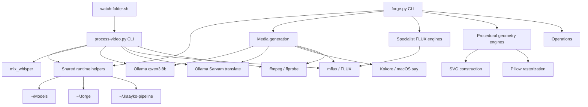
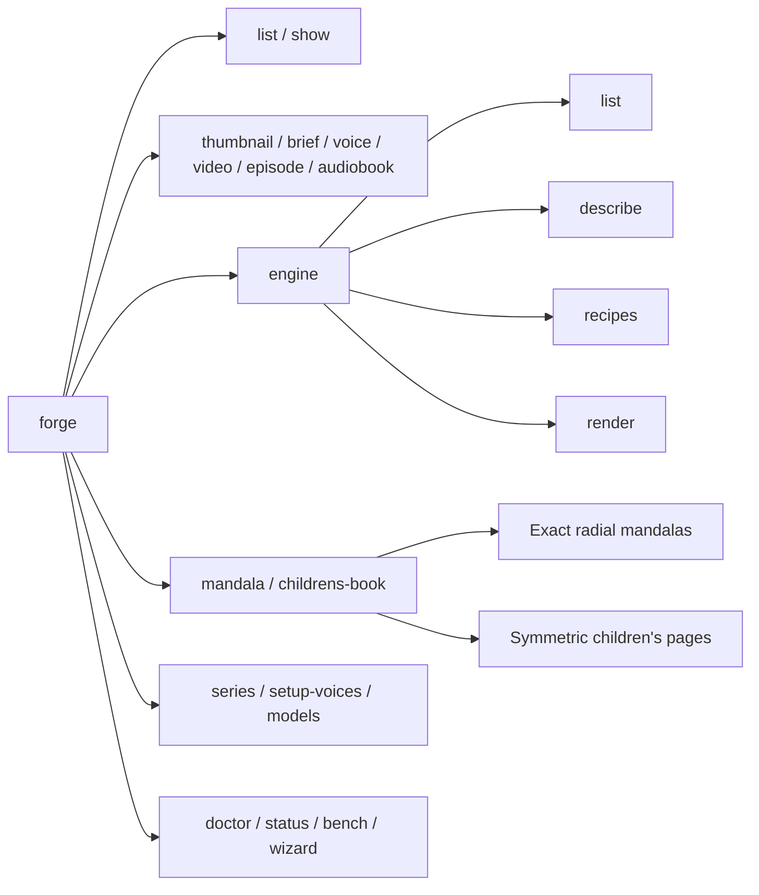
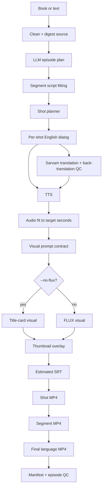
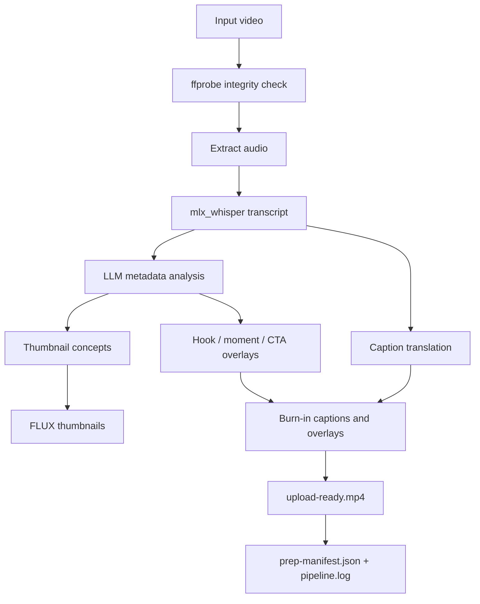
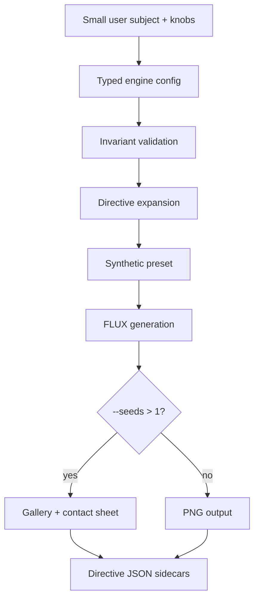
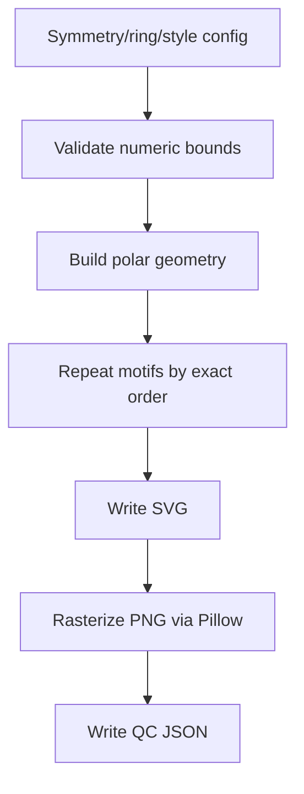
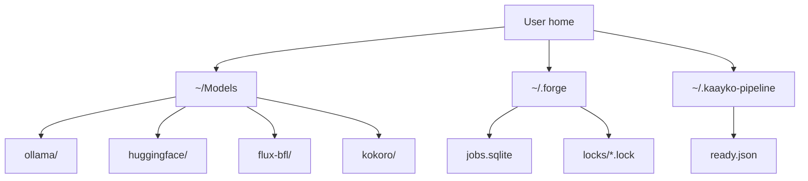

# Forge Architecture

Created: 2026-05-17

This document describes how Forge is built today. It separates the implemented
system from future work.

## System Overview

## Command Surface

## Episode Pipeline

Current limitation: subtitle timing in `forge episode` is estimated, not yet
forced-aligned from final generated audio.

## Process Video Pipeline

## Specialist FLUX Engine Flow

## Procedural Geometry Flow

Procedural engines are the right path when symmetry must be mathematical. FLUX
is not used in this path.

## Local State And Model Layout

## Artifact Philosophy

Forge should leave receipts:

- Inputs and settings are captured in manifests.
- Expensive/generated outputs are written atomically.
- QC JSON files explain what was checked.
- Long-running/background jobs write structured logs.
- Future publishability work should make blockers explicit instead of burying
  them in free-form notes.
