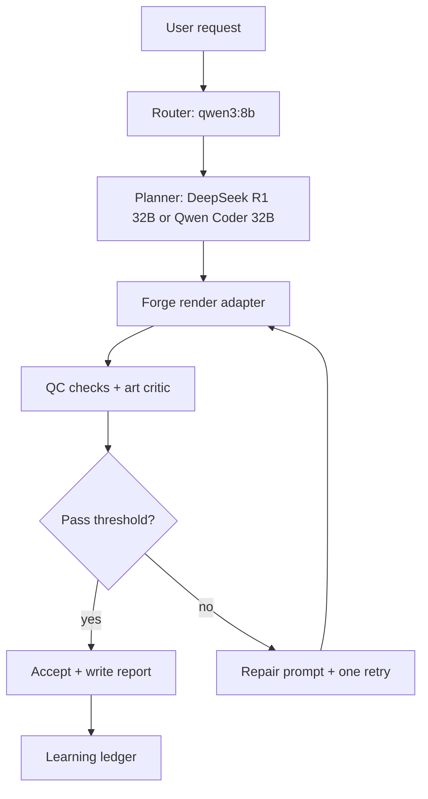
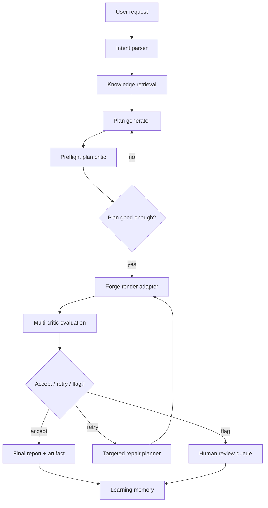

# Art Reasoning Engine Plan

Created: 2026-05-20

Status: planning document, not yet implemented.

Companion implementation spec: [ART_REASONING_ENGINE.md](ART_REASONING_ENGINE.md).

This document captures the first two viable plans for an isolated local art
reasoning engine for Forge. The goal is not a prettier prompt wrapper. The goal
is a closed-loop arts lab that plans, renders, evaluates, critiques, retries,
and remembers what worked.

The system must stay honest: self-evaluation is useful only when it is checked
against objective signals, written receipts, and Rohan's human ratings.

## North Star

Build an isolated `reasoning_lab/` that can sit beside Forge and call it as a
rendering tool.

It should:

- Turn a creative request into a structured plan.
- Retrieve relevant art rules, prior failures, species iconography, and prompt
  grammar before planning.
- Render through existing Forge commands.
- Evaluate outputs with multiple critics, not one model pretending to be final
  truth.
- Store every plan, prompt, scorecard, critique, repair decision, and human
  rating as learning data.
- Improve future plans through retrieval and preference memory, without claiming
  that model weights are being trained unless we actually fine-tune.

## Research Backbone

The engine should use research as scaffolding for decisions and tests:

| Idea | Use in Forge | Reference |
| --- | --- | --- |
| Retrieval-augmented generation | Pull local docs, rubrics, species rules, and prior failures before the planner speaks. | Lewis et al., 2020, [Retrieval-Augmented Generation](https://arxiv.org/abs/2005.11401) |
| Iterative self-refinement | Generate a plan, critique it, revise it, then render. | Madaan et al., 2023, [Self-Refine](https://arxiv.org/abs/2303.17651) |
| Verbal learning from failures | Store concise failure lessons and retrieve them on similar future requests. | Shinn et al., 2023, [Reflexion](https://arxiv.org/abs/2303.11366) |
| LLM judges with bias controls | Use model critics, but guard against verbosity, position, and self-preference bias. | Zheng et al., 2023, [Judging LLM-as-a-Judge](https://arxiv.org/abs/2306.05685) |
| Prompt-image alignment | Compare requested visual atoms against rendered output. | Radford et al., 2021, [CLIP](https://arxiv.org/abs/2103.00020) |
| Human preference scoring | Add learned aesthetic/preference signals when local models are available. | Xu et al., 2023, [ImageReward](https://arxiv.org/abs/2304.05977); Wu et al., 2023, [HPSv2](https://arxiv.org/abs/2306.09341) |
| Compositional image evaluation | Catch failures such as missing attributes, counts, relations, or subject identity. | Huang et al., 2023, [T2I-CompBench](https://arxiv.org/abs/2307.06350) |

## Local Model Reality

Available now:

| Role | Model/tool | Status |
| --- | --- | --- |
| Fast router | Ollama `qwen3:8b` | Ready |
| Fast reasoning | Ollama `deepseek-r1:8b` | Ready |
| Structured planner | `mlx-community/DeepSeek-R1-Distill-Qwen-32B-4bit` | Cached |
| Code/plumbing planner | `mlx-community/Qwen2.5-Coder-32B-Instruct-4bit` and Ollama `qwen2.5-coder:32b` | Ready |
| Art/VLM starter | `mlx-community/gemma-4-e2b-it-4bit` | Cached |
| Retrieval embeddings | `BAAI/bge-m3` | Cached |
| Renderers | FLUX.1 schnell/dev/kontext, FLUX.2 klein, Z-Image Turbo, LoRAs | Ready |
| OCR/text leak | Tesseract path exists in QC design, install/runtime may vary | Verify |
| Transcription/audio QC | `mlx-community/whisper-large-v3-*`, Kokoro, Sarvam translate | Ready |

Gaps:

- `mlx-vlm` is not installed yet, so image-aware MLX critique is not wired.
- Stronger art critics should be downloaded later:
  `mlx-community/gemma-4-31b-it-4bit`,
  `mlx-community/gemma-4-26b-a4b-it-4bit`,
  and `mlx-community/Qwen3.6-35B-A3B-4bit` if available and stable.
- `mlx-community/Qwen2.5-72B-Instruct-4bit` appears partial/incomplete in cache.

## Plan V1: Practical Critique Loop

This is the fastest useful implementation. It wraps the current Forge render
path and adds structured planning, critique, and a one-step repair loop.

### Architecture



### Scope

- Create `reasoning_lab/` as an isolated package.
- Add an Ollama provider and an MLX text provider.
- Define JSON schemas for plan, critique, scorecard, and retry decision.
- Use existing Forge Madhubani render commands as the first render adapter.
- Score with existing QC checks plus one LLM art critique.
- Store run receipts as JSONL.
- Produce one HTML or Markdown run report per request.

### Critical Rating

Rating: 7/10.

Strengths:

- Shippable quickly.
- Uses current models and current Forge paths.
- Makes visible progress toward "render -> judge -> repair".
- Gives the UI a real reasoning terminal sooner.

Weaknesses:

- The critic is still too subjective unless paired with stronger visual checks.
- One retry can overfit to prompt wording instead of solving the actual image
  failure.
- The learning layer is a ledger, not yet a robust preference model.
- Without human calibration, the system may become confidently mediocre.

Verdict: good MVP, not the final brain.

## Plan V2: Isolated Research-Backed Reasoning Lab

This is the proper product architecture. It treats Forge as a tool used by a
separate reasoning system, with multiple critics and a durable memory.

### Architecture



### Folder Shape

```text
reasoning_lab/
  README.md
  pyproject.toml
  reasoning_lab/
    providers/
      ollama.py
      mlx_lm.py
      mlx_vlm.py
    memory/
      embeddings.py
      retrieval.py
      ledger.py
    schemas/
      plan.schema.json
      critique.schema.json
      scorecard.schema.json
      run.schema.json
    critics/
      art_history.py
      rubric.py
      prompt_alignment.py
      composition.py
      text_leakage.py
    runners/
      forge_madhubani.py
    reports/
      render_report.py
    engine.py
  tests/
```

### Critic Stack

Each output should be judged by separate signals:

| Critic | What it checks | Failure mode caught |
| --- | --- | --- |
| Rubric critic | Project-specific pass/fail rules from docs and schema | Violates Forge/Madhubani contract |
| Visual atom critic | Required subject details, counts, decoration zones, pose, palette | Missing concrete elements |
| Composition critic | Centering, scale, crop, negative space, readability | Bad layout despite correct subject |
| Art-history critic | Tradition, taste, register, authenticity risk | Generic AI style or shallow imitation |
| OCR/text leakage | Random text, signatures, watermarks | Product-blocking artifacts |
| Preference critic | Aesthetic strength and production suitability | Technically passing but weak image |
| Human rating | Rohan's final taste signal | Model overconfidence |

### Learning

Learning means retrieval-weighted memory first, not magical self-training.

Store:

- Request.
- Retrieved context.
- Structured plan.
- Render command.
- Prompt and seed.
- Image path and sidecar paths.
- Critic scorecards.
- Retry decision.
- Final accepted/rejected status.
- Human rating and notes.

Then future runs retrieve:

- Similar successful prompts.
- Similar failed prompts.
- Prior repairs that worked.
- Rohan's ratings for related styles, animals, poses, and products.

### Critical Rating

Rating: 9/10.

Strengths:

- Honest architecture with separable planner, renderer, critics, and memory.
- Supports objective checks and subjective art critique at the same time.
- Lets us add stronger local VLMs without changing the whole system.
- Creates a durable quality dataset for later fine-tuning or preference models.
- Fits the existing Forge philosophy: local-first, receipt-heavy, measurable.

Weaknesses:

- Slower to build.
- Requires careful schema discipline or it becomes a pile of prompts.
- Multi-critic scoring can disagree, so the decision policy must be explicit.
- Human calibration is mandatory; otherwise "learning" becomes self-confirmation.

Verdict: correct architecture. Build this, but start with a narrow vertical
slice.

## Recommendation

Use Plan V2 as the architecture and Plan V1 as the first implementation slice.

The first build should not attempt every critic and every model. It should prove
one complete loop:

```text
request -> retrieve rules -> plan -> preflight critique -> render -> score ->
repair once -> final report -> memory write
```

## First Slice

### Goal

Render one Madhubani animal request through the isolated reasoning lab and
produce a report that explains why the output was accepted, retried, or flagged.

### Deliverables

- `reasoning_lab/` package skeleton.
- Provider adapter for Ollama `/api/generate`.
- Provider adapter for `mlx_lm.generate` or Python `mlx_lm`.
- Local document retriever over:
  - `docs/MADHUBANI_ART_IDENTITY.md`
  - `docs/catalog/RUBRIC.md`
  - `docs/catalog/PROMPT_GRAMMAR.md`
  - `brand/madhubani/animals.json`
  - `brand/madhubani/poses.json`
- JSON schema for `Plan`, `Scorecard`, and `RunReceipt`.
- Forge Madhubani render runner.
- Critic v0:
  - rubric compliance
  - required visual atoms
  - composition notes
  - art critique notes
  - retry recommendation
- JSONL learning ledger.
- Markdown report.

### Acceptance Criteria

- A run can be executed without changing production Forge code paths.
- Every model call records model name, prompt hash, token estimate or exact
  usage when available, latency, and raw JSON response.
- The final report contains:
  - original request
  - retrieved context summary
  - structured plan
  - render command
  - critic scorecard
  - retry decision
  - final recommendation
  - artifact paths
- The system refuses to call a render "mastered" without a scorecard.
- Human rating can be appended after the run.

## Decision Policy

Use explicit thresholds so the engine cannot hide uncertainty.

| Score | Meaning | Action |
| --- | --- | --- |
| 0.90-1.00 | Strong pass | Accept |
| 0.75-0.89 | Usable but imperfect | Accept only if no blocker; otherwise retry |
| 0.55-0.74 | Weak | Retry if failure is actionable |
| below 0.55 | Failed | Flag, do not retry blindly |

Blockers override average score:

- Wrong subject.
- Missing required body/pose identity.
- Major anatomy contradiction.
- Text leakage or watermark.
- Cropped product subject.
- Style register mismatch.
- Human rating below threshold for a comparable prior case.

## Open Decisions For Rohan

1. Should the first slice target only Madhubani animal tees, or all Forge image
   engines?
2. Should the engine be allowed to spend two renders per request by default, or
   only retry after explicit approval?
3. Should human ratings be simple 1-5 scores, or a richer rubric with taste,
   product-readiness, authenticity, and novelty?
4. Should the UI expose raw model reasoning tokens, or only structured decision
   events and scorecards?

## Build Order

| Phase | Work | Done when |
| --- | --- | --- |
| 0 | Create isolated package and schemas | `reasoning_lab` imports and tests run |
| 1 | Add providers and model registry | Ollama and MLX text calls work with receipts |
| 2 | Add retrieval | Planner receives local docs and prior failures |
| 3 | Add planner and preflight critic | Bad plans are revised before render |
| 4 | Add Forge runner | Engine can call existing Madhubani render path |
| 5 | Add critic v0 and scorecard | Output receives pass/retry/flag decision |
| 6 | Add memory ledger | Runs and human ratings are queryable |
| 7 | Add report generator | One artifact explains the whole decision chain |
| 8 | Add VLM critic | `mlx-vlm` model checks actual image content |

## Success Definition

The Art Reasoning Engine is ready for real use when:

- It produces repeatable run receipts.
- It can explain why a render passed or failed.
- It can improve a second attempt using a specific prior failure.
- It stores lessons that affect later plans through retrieval.
- Rohan can rate outputs, and those ratings change future recommendations.
- The system clearly distinguishes objective QC, model critique, and human
  taste.

Done means the engine does not just make art. It argues with the result,
documents the argument, and learns from the verdict.
