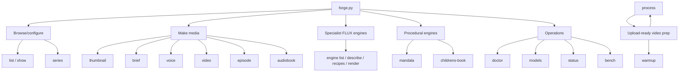

# Forge Feature Inventory

Created: 2026-05-17

This file documents features as they exist now. Planned behavior belongs in
`PLAN.md`, `PLAN_V2.md`, or `ALIGNMENT_PLAN.md` until implemented.

## Feature Families



## User-Facing Commands

| Command | Status | Primary output | Mechanism |
| --- | --- | --- | --- |
| `forge list` | Working | Preset and voice listing | Reads JSON from `brand/presets/` and `brand/voices.json`. |
| `forge show` | Working | Full preset JSON | Loads one preset by id. |
| `forge mandala` | Working | SVG, PNG, QC JSON | Procedural polar geometry in `mandala_engine.py`. |
| `forge childrens-book` | Working | Page SVGs, PNGs, QC JSON, manifest | Procedural vector pages in `mandala_engine.py`. |
| `forge folk-art` | Working initial grammar | SVG, PNG, QC JSON | Procedural folk/devotional coloring page in `mandala_engine.py`. |
| `forge engine` | Working | FLUX PNGs, directives, galleries | Typed style engines in `style_engines.py`. |
| `forge thumbnail` | Working | Branded PNG thumbnail | FLUX background plus PIL text overlay. |
| `forge voice` | Working | WAV/MP3/M4A/AIFF audio | Kokoro or macOS `say`; optional Sarvam translation. |
| `forge video` | Working | MP4 from image + audio | ffmpeg still-image Ken Burns mux. |
| `forge edit` | Working | Edited PNG | FLUX.1-Kontext-dev or FLUX.1-dev img2img fallback. |
| `forge brief` | Working | Metadata, thumbnails, voiceover intro | Local LLM JSON plus FLUX plus TTS. |
| `forge episode` | Working with known QC gaps | Per-language videos/audio/scripts/subtitles/QC | LLM planning, shot planning, FLUX/title cards, TTS, Sarvam, ffmpeg. |
| `forge audiobook` | Working audio pipeline | Per-language audiobook WAVs, scripts, subtitles, QC | Text chunking, TTS, Sarvam, audio concat. |
| `forge series` | Working | Series JSON locks | Deterministic world/style/cast seed data. |
| `forge setup-voices` | Working | Kokoro model files | Downloads/validates Kokoro assets. |
| `forge doctor` | Working | Runtime health report | Tool/model/cache checks in `forge_runtime.py`. |
| `forge status` | Working with stale-lock caveat | Job and lock report | SQLite job store plus lock files. |
| `forge bench` | Working | Profile guidance | Local quality profile vocabulary. |
| `forge models` | Working | Model inventory/adopt/clean | Canonical `~/Models` helpers. |
| `forge wizard` | Working | Interactive menu | Prompts into command namespaces. |
| `process-video warmup` | Working | Ready marker | Preflight dependency/cache checks. |
| `process-video process` | Working | Upload-ready bundle | Whisper, LLM analysis, captions, overlays, thumbnails, burn-in. |
| `watch-folder.sh` | Working | Folder automation | Stable-file watcher around `process-video`. |

## Procedural Mandala

**Command**

```sh
forge mandala --style floral --symmetry 24 --rings 9 --complexity max --out mandala.png
```

**Outputs**

- `mandala.png`
- `mandala.svg`
- `mandala.qc.json`

**Mechanism**

- Builds motifs in polar coordinates around a fixed center.
- Uses exact symmetry order for radial repetition.
- Uses style-specific geometry grammars, not just palette swaps:
  `coloring`, `floral`, `geometric`, `sacred`, `playful`, and `luxury` now
  emit different motif families.
- Repeats canonical motif templates with SVG `rotate()` transforms rather than
  recomputing each copy independently.
- Emits SVG first, then rasterizes to PNG with Pillow.
- Writes QC metadata with ring count, motif count, shape count, center, and
  pixel-level sanity checks. QC also records the selected style grammar and
  symmetry construction contract.

**Limits**

- It is intentionally vector/line-art oriented.
- Pixel rotation QC is a sanity check; construction math is the source of truth.

## Symmetric Children's Drawing Book

**Command**

```sh
forge childrens-book --theme all --pages 3 --symmetry 12 --rings 7 --complexity max --out pages/
```

**Outputs**

- `page-01-rabbits-garden.png/.svg/.qc.json`
- `page-02-crows-texas.png/.svg/.qc.json`
- `page-03-blue-jay.png/.svg/.qc.json`
- `manifest.json`

**Mechanism**

- Uses the procedural mandala border as a symmetric frame.
- Draws central subject geometry with bilateral or paired symmetry.
- Avoids diffusion entirely, so there are no accidental signatures, text, or
  malformed generated marks.

**Limits**

- Current subjects are `rabbits-garden`, `crows-texas`, and `blue-jay`.
- The style is printable line art, not photorealism.

## Folk Devotional Coloring Page

**Command**

```sh
forge folk-art --theme buddha-peacock --width 2400 --height 1800 --out buddha-peacock.png
```

**Outputs**

- `buddha-peacock.png`
- `buddha-peacock.svg`
- `buddha-peacock.qc.json`

**Mechanism**

- Procedurally composes a central serene figure, halo lotus ring, paired
  peacocks, tree arches, woven lower border, hatching, and stippling.
- Emits SVG first, then PNG, with no diffusion and no generated text.
- QC records motif families and the paired side-motif symmetry contract.

**Limits**

- Initial theme is `buddha-peacock`.
- This is an original procedural page inspired by folk devotional coloring-art
  structure; it is not a copy of any reference image.

## Specialist FLUX Engines

**Commands**

```sh
forge engine list
forge engine describe wildlife-photo
forge engine recipes --engine impressionist
forge engine render wildlife-photo --subject "blue jay perched on a branch"
```

**Engines**

- `noir-cinema`
- `wildlife-photo`
- `impressionist`
- `indian-classical`
- `childrens-coloring-book`
- `mandala-art`
- `stylized-cinematic`
- `minimalist-tshirt`

**Outputs**

- PNG render.
- Directive sidecar JSON.
- Optional multi-seed gallery and `contact-sheet.html`.

**Mechanism**

- Typed dataclass configs expand small user input into long FLUX directives.
- Engine invariants reject invalid combinations before generation.
- Domain-specific negatives are stacked with Forge's master primer.
- Rendering routes through the same FLUX generation path as thumbnails.
- `minimalist-tshirt` is optimized for low-ink apparel marks, print-art mode,
  shirt mockups, and no generated typography.

**Limits**

- These engines still depend on diffusion and may require seed iteration.
- Procedural symmetry should use `forge mandala`, not `forge engine`.

## Thumbnail

**Command**

```sh
forge thumbnail --preset cinematic --concept "..." --headline "..." --out thumb.png
```

**Outputs**

- Final PNG.
- Background PNG when generated by FLUX.

**Mechanism**

- Preset JSON defines palette, type, composition, and FLUX prompt rules.
- FLUX generates a 16:9 background unless `--bg` is provided.
- PIL composes headline/subtitle overlay.
- Series and LoRA options can lock batch consistency.

## Voice

**Command**

```sh
forge voice --preset male_warm --text "Welcome back." --translate hi,mr --out intro.wav
```

**Outputs**

- Source audio.
- Optional translated `.txt` and sibling localized audio files.

**Mechanism**

- `FORGE_TTS_ENGINE=auto` prefers Kokoro when installed, otherwise macOS `say`.
- Translation uses local Sarvam through Ollama.
- Audio writers use explicit codecs and validation.

## Brief

**Command**

```sh
forge brief --topic "..." --preset tartakovsky --voice male_warm --out episode-kit/
```

**Outputs**

- Metadata.
- Three thumbnails.
- Voiceover intro.
- `brief.json`.

**Mechanism**

- Local LLM generates structured JSON.
- FLUX renders thumbnail variants.
- TTS renders the intro voiceover.

## Episode

**Command**

```sh
forge episode --book story.txt --segments 4 --seconds 15 --shots-per-segment 4 --translate hi,mr --out episode/
```

**Outputs**

- `episode-plan.json`
- `episode-manifest.json`
- `scripts/`
- `audio/raw/`
- `audio/final/`
- `subtitles/`
- `thumbnails/`
- `videos/segments/`
- `videos/final/`
- `qc/episode-qc.json`

**Mechanism**

- LLM adapts source into segment plan.
- Shot planner creates per-shot dialog and visual contracts.
- FLUX or no-FLUX title cards provide visuals.
- TTS creates per-shot audio.
- Sarvam produces Hindi/Marathi translations with two-pass back-translation QC.
- ffmpeg creates shot videos, segment videos, and final stitched outputs.

**Known gaps**

- Subtitles are currently estimated from text timing, not forced-aligned to final
  audio.
- QC is useful but not yet a hard publishability gate.
- `review.html`, `--check`, `--resume`, and repair flows are planned, not built.

## Audiobook

**Command**

```sh
forge audiobook --book book.txt --translate hi,mr --out audiobook/
```

**Outputs**

- Chunk scripts.
- Per-chunk audio.
- Stitched per-language audiobook WAVs.
- SRT subtitles.
- `audiobook-manifest.json`
- `qc/audiobook-qc.json`

**Mechanism**

- Source text is chunked.
- English uses the selected voice route.
- Translation uses local Sarvam through Ollama.
- Per-language chunks are concatenated by ffmpeg.

**Clarification**

The `forge audiobook` wrapper is an audio-first pipeline. The older/direct
`bin/audiobook.py` script has additional RTF/video-mux behavior used by the
wizard path; keep those surfaces documented separately if they become official
CLI flags.

## Process Video

**Command**

```sh
process-video warmup
process-video process clip.mp4 --quality good --captions en,hi,mr
```

**Outputs**

- Extracted audio.
- Whisper transcript in JSON/SRT/VTT/TXT.
- Caption translations.
- Metadata/title/description/tags.
- Overlays.
- Thumbnail concepts and images.
- `upload-ready.mp4`
- `prep-manifest.json`
- `pipeline.log`

**Mechanism**

- `warmup` verifies dependencies and model cache before field use.
- `process` validates input streams, extracts audio, runs Whisper, calls local
  LLM for metadata/overlays, translates captions, and burns captions/overlays
  through ffmpeg.

**Known gaps**

- Music ducking is planned but not implemented.
- Portrait video handling is still a known improvement area.

## Operational Features

### Models

`forge models scan|adopt|clean` keeps model files under `~/Models` and helps
avoid duplicate downloads.

### Doctor

`forge doctor --deep` verifies tools, model caches, Ollama models, and canonical
paths.

### Status

`forge status` shows jobs and resource lock files. It can currently show stale
lock file contents; stale-lock labeling is tracked as a fix.

### Series

`forge series` creates and inspects JSON world/style/cast locks that can be used
with thumbnails and briefs.
