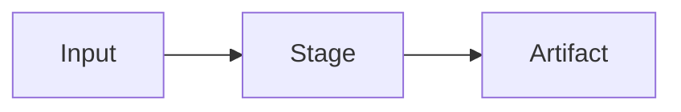

# Feature Documentation Template

Copy this into [FEATURES.md](FEATURES.md) or a dedicated feature doc when adding
a substantial Forge feature.

## Feature Name

**Status:** Working / Experimental / Planned / Deprecated

**Command**

```sh
forge command --flag value --out output/
```

**Purpose**

One or two sentences explaining the user problem.

**Inputs**

- Input file/path/text.
- Important flags.
- Required local models/tools.

**Outputs**

```text
output/
  artifact.ext
  manifest.json
  qc.json
```

**Mechanism**



Describe the implementation in concrete terms:

- Which module owns it?
- Which helpers are reused?
- Which model/tool is called?
- Which caches or locks are involved?

**QC / Validation**

- What gets validated?
- What is blocked?
- What is only warned?

**Failure Modes**

- Missing model/tool.
- Invalid input.
- Partial output.
- Quality risk.

**Known Limits**

- Be honest about what this cannot do yet.

**Verification**

```sh
python3 -m unittest tests/test_runtime.py
forge command --small-smoke-test
```
