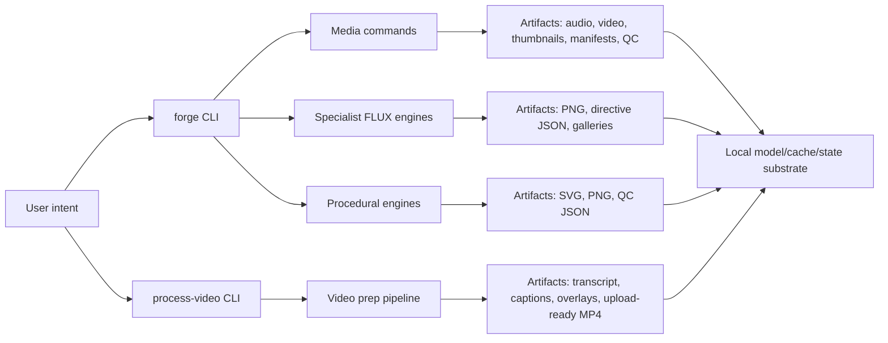
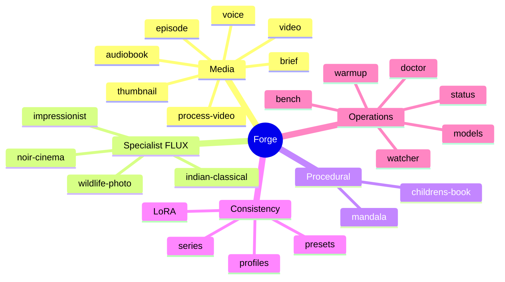

# Forge Documentation Index

Created: 2026-05-17

Forge documentation is now treated as part of the product. A feature is not
complete unless its command surface, outputs, mechanisms, quality checks, limits,
and review path are documented.

## High-Level Summary

Forge is a local production system for media and visual asset generation on
Apple Silicon. It has three major layers:

- **Media production**: thumbnails, briefs, voiceovers, episodes, audiobooks,
  and upload-ready video processing.
- **Specialist image engines**: domain-specific FLUX prompt builders for
  wildlife, impressionist, noir, and Indian classical imagery.
- **Procedural geometry engines**: exact SVG/PNG mandalas and symmetric
  children's drawing-book pages, generated without diffusion.

## Documentation Map

| Document | Purpose |
| --- | --- |
| [FEATURES.md](FEATURES.md) | Current feature inventory, commands, outputs, mechanisms, limits. |
| [ARCHITECTURE.md](ARCHITECTURE.md) | System diagrams and data-flow diagrams. |
| [MECHANISMS.md](MECHANISMS.md) | Cross-cutting implementation mechanisms and quality contracts. |
| [MASTERY_PLAN.md](MASTERY_PLAN.md) | Focused plan for pictures, thumbnails, audiobooks, coloring books, and mathematical mandalas. |
| [DOCUMENTATION_PROTOCOL.md](DOCUMENTATION_PROTOCOL.md) | Rules for documenting every new feature as it is built. |
| [FEATURE_TEMPLATE.md](FEATURE_TEMPLATE.md) | Copy/paste template for future feature docs. |
| [../README.md](../README.md) | User-facing quickstart and common commands. |
| [../SKILL.md](../SKILL.md) | Mental model: when and why to use each tool. |
| [../PLAN_V2.md](../PLAN_V2.md) | North Star and next build phases. |
| [../ALIGNMENT_PLAN.md](../ALIGNMENT_PLAN.md) | Gap assessment and alignment plan. |
| [../AUDIT.md](../AUDIT.md) | Output-correctness audit and known invariants. |

## Source Of Truth Rules

- **CLI truth** lives in `bin/forge.py` and `bin/process-video.py`.
- **Runtime and quality mechanisms** live in `bin/forge_runtime.py`.
- **Specialist FLUX engines** live in `bin/style_engines.py` and
  `bin/_engine_base.py`.
- **Procedural geometry engines** live in `bin/mandala_engine.py`.
- **Brand data** lives in `brand/`.
- **Docs must describe the implementation that exists now**, and future or
  aspirational behavior must be explicitly labeled as planned.

## Current Product Shape

## Documentation Status

Current docs now cover:

- Command inventory.
- High-level architecture.
- Feature mechanisms.
- Procedural engines.
- Specialist style engines.
- Media pipelines.
- Documentation expectations for future work.

Known documentation work still worth doing:

- Add per-engine visual examples for `forge engine`.
- Add screenshots of `review.html` once the dashboard exists.
- Add a release/changelog file if Forge starts using tagged releases.
