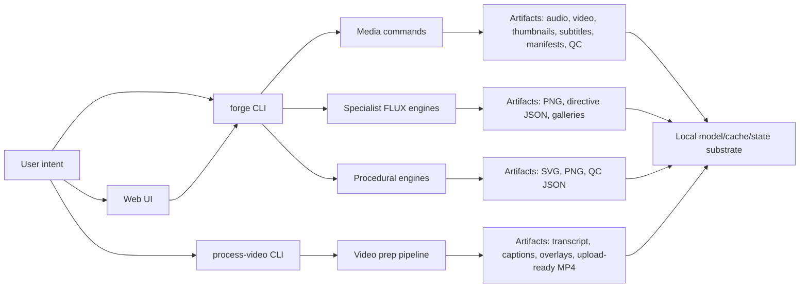
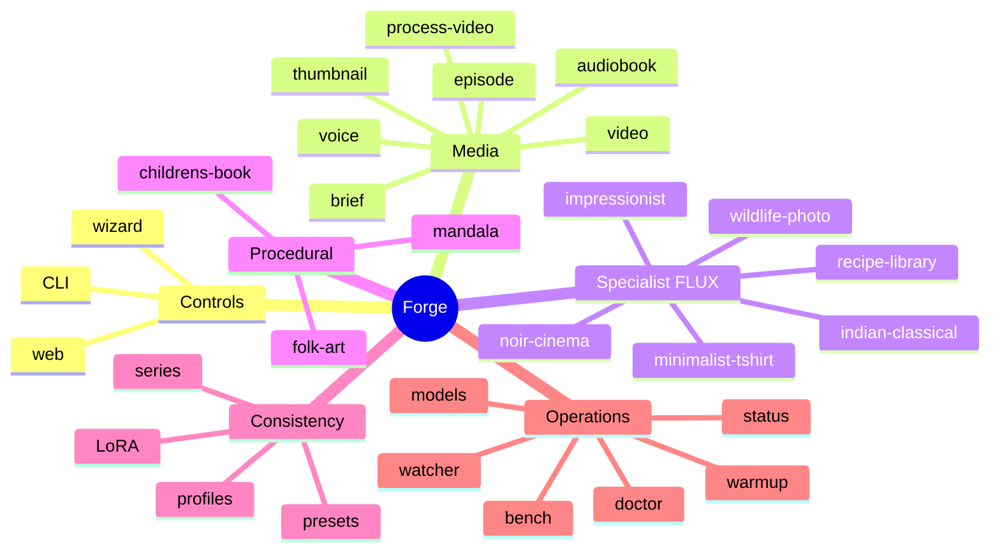

# Forge Documentation Index

Last updated: 2026-05-18

Forge documentation is part of the product. A feature is not complete unless its
command surface, outputs, mechanisms, quality checks, limits, and review path are
documented.

## High-Level Summary

Forge is a local-first production system for media and visual asset generation on
Apple Silicon. Its current shape has five major layers:

- Web and CLI controls for repeatable production workflows.
- Media production: thumbnails, briefs, voiceovers, episodes, audiobooks, and
  upload-ready video processing.
- Specialist image engines: domain-specific FLUX prompt builders for wildlife,
  noir, impressionist, Indian classical, and related image systems.
- Procedural geometry engines: SVG/PNG mandalas, symmetric children's pages, and
  folk/devotional line art.
- Operations: model cache management, job state, resource locks, doctor checks,
  quality profiles, and handoff docs.

## Start Here

| Document | Purpose |
| --- | --- |
| [../README.md](../README.md) | Project front door, install, daily commands, sharp edges, complete doc map. |
| [../SKILL.md](../SKILL.md) | Mental model for choosing the right Forge tool and understanding how the system is built. |
| [FEATURES.md](FEATURES.md) | Current feature inventory, command surface, outputs, mechanisms, and limits. |
| [ARCHITECTURE.md](ARCHITECTURE.md) | System diagrams and data-flow diagrams. |
| [MECHANISMS.md](MECHANISMS.md) | Cross-cutting implementation mechanisms and quality contracts. |
| [MINIMALIST_TSHIRT_ENGINE.md](MINIMALIST_TSHIRT_ENGINE.md) | Specialist engine contract for minimalist screen-printable T-shirt graphics. |

## Handoffs, Audits, And Contracts

| Document | Purpose |
| --- | --- |
| [BOOK_LOCALIZATION_AUDIT_HANDOFF.md](BOOK_LOCALIZATION_AUDIT_HANDOFF.md) | Complete audit and agent handoff for near-perfect 10-page Hindi/English/Marathi subtitles and audio. |
| [PRESET_PRECISION_IMPROVEMENT_HANDOFF.md](PRESET_PRECISION_IMPROVEMENT_HANDOFF.md) | Research-backed handoff to improve preset precision by at least 40%. |
| [PRESET_PROMPT_TEMPLATE.md](PRESET_PROMPT_TEMPLATE.md) | Complete template for semantic preset tokens, prompt blocks, and dependency vectors. |
| [WHATSAPP_JOKE_FACTORY_HANDOFF.md](WHATSAPP_JOKE_FACTORY_HANDOFF.md) | Agent blueprint for a safe WhatsApp joke factory for Indian audiences over 60. |
| [AUDIOBOOK_API.md](AUDIOBOOK_API.md) | Public API contract for audiobook CLI, web UI, Python API, outputs, configuration, and versioning. |
| [AUDIOBOOK_HANDOFF.md](AUDIOBOOK_HANDOFF.md) | Handoff brief for audiobook quality/perfection work. |
| [COLORING_BOOK_SCIENCE.md](COLORING_BOOK_SCIENCE.md) | Research-backed methodology for children's coloring-book prompt and engine quality. |
| [../AUDIT.md](../AUDIT.md) | Output-correctness audit and enforced invariants for audio, image, and video outputs. |

## Planning And Execution

| Document | Purpose |
| --- | --- |
| [../PLAN.md](../PLAN.md) | Future work list constrained around local/offline-capable production. |
| [../PLAN_V2.md](../PLAN_V2.md) | Local story-studio north star, output contracts, architecture, M5 Max strategy, quality gates. |
| [../ALIGNMENT_PLAN.md](../ALIGNMENT_PLAN.md) | Gap assessment, definition of aligned, and execution plan. |
| [../BACKLOG.md](../BACKLOG.md) | Feature backlog for pipelines, style engines, plumbing, and UI/system work. |
| [MASTERY_PLAN.md](MASTERY_PLAN.md) | Mastery plan for pictures, thumbnails, audiobooks, coloring books, and mathematical mandalas. |

## Documentation Maintenance

| Document | Purpose |
| --- | --- |
| [DOCUMENTATION_PROTOCOL.md](DOCUMENTATION_PROTOCOL.md) | Required documentation updates per feature and accuracy rules. |
| [FEATURE_TEMPLATE.md](FEATURE_TEMPLATE.md) | Copy/paste template for future feature docs. |
| [../BRAND-LORA.md](../BRAND-LORA.md) | Brand LoRA training, validation, install, and usage guide. |
| [../brand/loras/README.md](../brand/loras/README.md) | LoRA directory notes. |
| [../brand/references/README.md](../brand/references/README.md) | Brand/reference image directory notes. |

## Source Of Truth Rules

- Main CLI truth lives in `bin/forge.py`.
- Web UI truth lives in `bin/forge_web.py`, but every image-affecting web field
  must map to a backend argument or environment setting.
- Video prep truth lives in `bin/process-video.py`.
- Deep audiobook/video-book truth lives in `bin/audiobook.py`.
- Runtime and quality mechanisms live in `bin/forge_runtime.py`.
- Specialist FLUX engines live in `bin/style_engines.py` and `bin/_engine_base.py`.
- Procedural geometry engines live in `bin/mandala_engine.py`.
- Brand data lives in `brand/`.
- Series consistency locks live in `series/`.
- Future or aspirational behavior must be explicitly labeled as planned.

## Current Product Shape

## Documentation Status

Covered now:

- Root README with install, commands, model cache, profiles, environment variables,
  current limits, and complete documentation map.
- Feature inventory and architecture.
- Runtime mechanisms and quality contracts.
- Book-localization audit and agent handoff.
- Preset-precision improvement handoff.
- Preset prompt template and dependency-vector contract.
- WhatsApp joke factory agent blueprint.
- Audiobook API and quality handoff.
- Coloring-book research and methodology.
- Planning, backlog, and alignment docs.

Still worth adding:

- Screenshots of the web UI once the target dashboard layout stabilizes.
- Per-engine visual examples for `forge engine`.
- A changelog/release file if Forge starts using tagged releases.
- A generated CLI reference if command help starts changing frequently.
