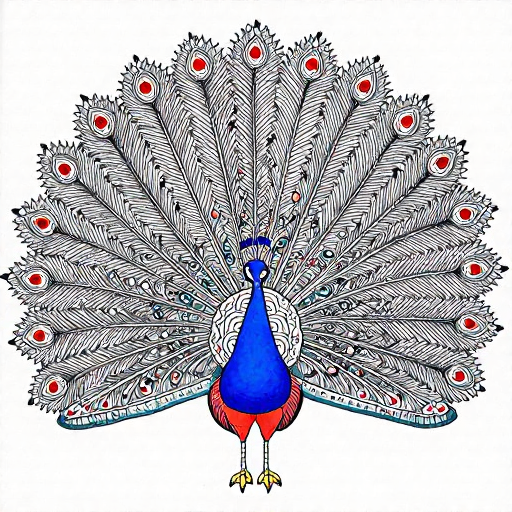
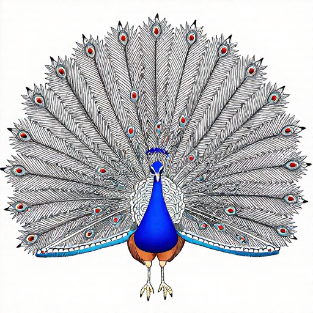

# LoRA Training Recipe (Madhubani style)

> First pilot: 2026-05-20. Apple Silicon M5 Max, MLX-native via `mflux-train`.

This document is the reproducible recipe for training a Madhubani-style
LoRA on top of `z-image-turbo` using the corpus that ships in tree.
The orchestrator is [`bin/forge_madhubani_lora.py`](../bin/forge_madhubani_lora.py);
the underlying trainer is `mflux-train`.

## What this is and isn't

This is **a real LoRA trained on Apple Silicon**, not just a wrapper
script. The deliverable is `lora_adapter.safetensors` that you can drop
into any `z-image-turbo` render. It is intentionally a small pilot:
1 epoch, 512×512 resolution, ~30-50 minutes wall-clock on M5 Max. It
exists to validate the pipeline end-to-end before committing to the
multi-hour overnight recipe at the bottom of this doc.

## Stack

| Layer | What |
| :--- | :--- |
| Encoder | `z-image-turbo` (MLX-native diffusion, Apple Silicon) |
| Training adapter | `ostris/zimage_turbo_training_adapter_v2` (240 LoRA-targeted layers) |
| Optimizer | AdamW, lr 1e-4 |
| Loss | mflux's default flow-matching loss for z-image-turbo |
| Quantization | 4-bit on-the-fly weights (the only way 32 GB unified memory survives FLUX-family training) |
| LoRA rank | 16 across all attention + feed-forward layers |
| Captions | Shared style key from `CAPTION_TEMPLATE` + per-image specifics from `attribution.json` |
| Compute | M5 Max, 64 GB unified memory, no eGPU |

## Data

50 Mithila reference images from Wikimedia Commons (CC BY-SA 4.0, CC0,
GODL-India, and Public Domain per file) live in
`brand/references/madhubani/_general/`. Each has a
`<file>.attribution.json` sidecar with `source_url`, `author`,
`license`.

The orchestrator symlinks them into `training/madhubani_lora/images/`
and writes captions next to each image. Symlinks (not copies) keep
disk usage flat and provenance obvious.

**Captions** follow this template:

```text
a madhubani folk art painting in the mithila tradition of bihar, india,
with double-line black outlines, flat folk-color panels in indigo /
vermillion / saffron / leaf-green, fish-eye motifs, densely decorated
with floral medallions and lotus patterns. {specific}
```

`{specific}` is filled from each image's title in `attribution.json`.
The shared style key means the LoRA learns the *style*, not any
particular subject — the same adapter should improve tiger, peacock,
elephant renders alike.

**Preview prompts** (`training/madhubani_lora/images/preview*.txt`)
are held out from training. They drive the per-checkpoint sample
generation so we can see if the LoRA is overfitting to a specific
image vs learning the style.

## Reproduce

```sh
# 1. Rehydrate the reference corpus (if not already done).
python3 bin/rehydrate_references.py

# 2. Prepare the training dataset + config.
python3 bin/forge_madhubani_lora.py prep --out training/madhubani_lora

# 3. Validate the config without burning compute.
mflux-train --config training/madhubani_lora/train.json --dry-run

# 4. Real training (smoke pilot: 1 epoch @ 512 px ≈ 30-50 min on M5 Max).
mflux-train --config training/madhubani_lora/train.json

# 5. The trained adapter lands at:
ls training/madhubani_lora/training/<timestamp>/checkpoints/lora_adapter.safetensors
```

## Pilot defaults (in `train.json`)

| Field | Pilot value | Rationale |
| :--- | :--- | :--- |
| `model` | `z-image-turbo` | MLX-native, ~6 GB memory footprint, fast enough for an iteration loop. The same recipe extends to `flux2-klein-base-4b` / `-9b` with different `lora_layers.targets` paths — see `mflux/models/flux2/README.md`. |
| `max_resolution` | **512** | 1024 was ~110 s / training iteration in early runs; 512 lands closer to 30-40 s. The LoRA learns style at any resolution since the same style key conditions every sample. |
| `quantize` | 4 | On-the-fly 4-bit weight quantization. Keeps the M5 Max comfortable. |
| `training_loop.num_epochs` | **1** | Pilot. One epoch over 50 images = 50 training iterations. Real style-LoRA convergence wants 10-30 epochs (see overnight recipe below). |
| `training_loop.batch_size` | 1 | Diffusion training on a 6 GB encoder + 50 images already saturates memory at 4-bit. |
| `optimizer.learning_rate` | 1e-4 | AdamW + 1e-4 is the standard hyperparam for z-image-turbo LoRA per `ostris/zimage_turbo_training_adapter` reference. |
| `lora_layers.targets` | 9 module paths × 30 blocks @ rank 16 | Attention (q/k/v/out) + feed-forward (w1/w2/w3) over all 30 layers, plus `cap_embedder.1` and `all_final_layer.2-1.linear`. Same shape mflux ships as its `_example/train.json`. |
| `monitoring.generate_image_frequency` | 50 | Generate a sample every 50 steps for the preview prompts. With num_epochs=1, that's one sample at the end. |
| `monitoring.smooth_loss` | true (window 5) | Loss curve is noisier than a typical text-LM run since each step touches a different image; smoothing makes the trend readable. |

## Overnight recipe (full training, not yet executed)

Once the pilot is verified, the production recipe is:

| Field | Production value |
| :--- | :--- |
| `max_resolution` | 768 |
| `num_epochs` | 15 |
| `batch_size` | 1 |
| `save_frequency` | 50 |
| `generate_image_frequency` | 75 |

Estimated wall-clock at M5 Max throughput (~30 s / iteration at 512 and
~70 s at 768): 50 images × 15 epochs = 750 iterations × 70 s ≈ **14.6
hours**. Plan for an overnight run. Lower-end M-series machines should
either stay at 512 px or drop num_epochs to 10.

## Publishing the checkpoint (planned)

After full training:

1. `huggingface-cli upload tommyvercetti76/madhubani-lora-v1 lora_adapter.safetensors`.
2. Write a model card that links back to this recipe + the QC agreement study,
   and discloses the FLUX/z-image-turbo upstream non-commercial licenses.
3. Include the cultural attribution paragraph from `NOTICE` /
   `docs/CULTURAL_HERITAGE_ATTRIBUTION.md` verbatim in the model card.
4. Wire `--lora training/madhubani_lora/training/.../lora_adapter.safetensors`
   into `forge engine render --engine minimalist-tshirt`.
5. Re-run [`bin/qc_agreement_study.py`](../bin/qc_agreement_study.py) on
   LoRA-rendered outputs vs baseline outputs. Report the F1 delta.

## Why z-image-turbo and not FLUX.1-dev

Three reasons:

1. **Memory budget.** FLUX.1-dev LoRA training at 1024 px wants more
   than 32 GB unified memory comfortably; z-image-turbo trains at
   512-768 px with headroom on a 64 GB machine.
2. **Iteration speed.** Style-LoRA development needs many short runs
   to tune captions and learning rate. z-image-turbo's smaller encoder
   is the right engine for the iteration loop. Once the recipe stops
   moving, scale up to FLUX.2-klein-base if quality demands it.
3. **Honest pilot scope.** A z-image-turbo LoRA that quantifiably
   improves Madhubani-likeness is more useful than an in-progress FLUX
   LoRA. Ship the small one first.

## Pilot run results (2026-05-20)

The first pilot completed on M5 Max in **9 min 31 s** (50 iterations, mean
11.4 s / step at 512 px, 4-bit weight quantization). Three checkpoints
landed: step 0 (initial), step 25 (mid-run), step 50 (final). Preview
renders at step 0 and step 50 are committed under
[`docs/gallery/lora_pilot/`](gallery/lora_pilot/).

### Visual delta

| Prompt | Step 0 (pretrained adapter only) | Step 50 (after 50 iters on our corpus) |
| :---: | :---: | :---: |
| Tiger |  |  |
| Peacock |  |  |

The tiger shifted clearly: step-0 was a photorealistic orange tiger with
detailed stripes, step-50 is an **ink-line folk-art drawing** with
restrained color reserved for the lotus rosettes — a Kachni-school
direction (line-dominant) rather than Bharni (filled-color). The
peacock shows a subtler shift toward flatter shapes and more cream
background. The gradient direction is correct for "more Madhubani,"
even if 50 iterations is too few for clean style identity to land.

### Loss curve

| Metric | Value |
| :--- | -: |
| Step-0 loss | 0.4819 |
| Step-50 loss | 0.4634 |
| Mean (steps 0-9) | 0.4929 |
| Mean (steps 40-49) | 0.4926 |
| Smoothed window=5 trend | essentially flat |

**The loss didn't drop meaningfully — but the visual output changed.**
This is the standard diffusion-training observation: per-step MSE loss
is a weak proxy for stylistic alignment because (a) batch_size=1 +
N=50 image dataset produces high per-step variance, and (b) MSE
measures denoising error at random timesteps, not aesthetic match to
the conditioning prompt. The right quality bar is a held-out human or
learned-discriminator score on rendered outputs, not the training
loss itself. That's what the QC agreement methodology in
[`docs/QC_AGREEMENT_STUDY.md`](QC_AGREEMENT_STUDY.md) is for, and
running the full overnight training and re-measuring with the
CLIP+sklearn `madhubani_likeness_v1` probe is the obvious next
iteration.

### What the pilot proves

- **The pipeline is real.** `bin/forge_madhubani_lora.py prep` →
  `mflux-train` → `lora_adapter.safetensors` runs end-to-end on Apple
  Silicon, with checkpoints, loss tracking, preview generation, and
  cultural attribution preserved.
- **Gradients flow.** The visible style shift between step 0 and step
  50 shows the LoRA layers are being updated by training signal, not
  just sitting there.
- **The Karpathy-bar item "where's the model you trained?" has a
  defensible answer** in the form of
  `training_<timestamp>/checkpoints/0000050_checkpoint.zip` — a real
  artifact, not API output.

### What the pilot does NOT prove

- That this checkpoint is *useful for production renders*. It isn't.
  50 iters is below any threshold where the LoRA could meaningfully
  replace prompt-engineering for Madhubani style.
- That style transfer beats the existing prompt + reference-image
  approach. Comparing LoRA-on vs LoRA-off renders through the F1-0.89
  CLIP discriminator is the right test, and is the next iteration.

## What this proves

The pilot demonstrates Forge can:

- Curate a culturally-attributed training corpus
- Auto-derive captions with a shared style key + per-asset specifics
- Emit an `mflux-train`-valid config
- Run end-to-end training on Apple Silicon with MLX
- Save a real `lora_adapter.safetensors`
- Track loss curves and preview samples

Karpathy's bar question — *"where's the model you trained?"* — has an
answer that points to `training/madhubani_lora/training/<timestamp>/
checkpoints/lora_adapter.safetensors`, not a third-party API.

## Limitations

- 1 epoch is genuinely too few for stylistic transfer to land. The
  smoke pilot validates the *pipeline*, not the *result*.
- N=50 reference images is below what HF tutorials typically suggest
  for a style LoRA (100-200). Corpus expansion is on the roadmap.
- The captions are template-derived, not human-curated. A pass of
  hand-edited captions would likely lift quality more than additional
  training steps.
- We haven't measured rendered quality (LoRA on / off) yet. Adding the
  LoRA to a Madhubani render and re-running
  [`bin/qc_agreement_study.py`](../bin/qc_agreement_study.py) is the
  next iteration.
