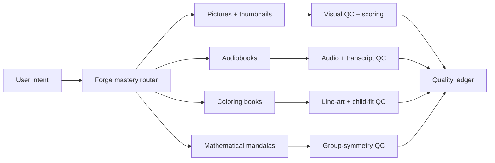

# Forge Mastery Plan

Created: 2026-05-17

## North Star

Forge should concentrate its best engineering energy on four craft domains:

1. **Pictures and thumbnails**: beautiful, legible, on-brand still images with
   measurable prompt-image alignment and no accidental text artifacts.
2. **Audiobooks**: reliable long-form narration, translation, pronunciation,
   pacing, subtitles, and audio quality receipts.
3. **Children's coloring and drawing books**: playful symmetry, printable line
   art, age-aware complexity, and future photo-to-coloring transformations.
4. **Mathematical mandalas**: exact procedural geometry with verifiable cyclic
   and dihedral symmetry.

Full video creation remains useful, but it is no longer the main frontier until
these domains have measurable quality gates and repair loops.

## What Changed Now

Token usage is now always printed for Forge LLM calls:

- `forge.py` Ollama JSON calls.
- `forge_runtime.py` Sarvam/Ollama translation calls.
- `process-video.py` Ollama JSON calls.
- `process-video.py` MLX fallback calls, estimated when exact counts are not
  exposed.
- `audiobook.py` thumbnail-brief Ollama calls.

The default is on. Set `FORGE_TOKEN_USAGE=0` only when a quiet machine-readable
run is required.

## Research Backbone

Forge should use research as evaluation scaffolding, not decoration:

- **Token and attention discipline**: Transformer attention makes context
  valuable, but wasteful context still increases cost and confusion. Source:
  [Attention Is All You Need](https://arxiv.org/abs/1706.03762).
- **Prompt-image alignment**: use CLIP-like image/text similarity to test whether
  a render actually depicts the requested concept. Source:
  [Learning Transferable Visual Models From Natural Language Supervision](https://arxiv.org/abs/2103.00020).
- **Perceptual image quality**: compare images with human-aligned perceptual
  metrics such as LPIPS and structural measures such as SSIM. Sources:
  [LPIPS](https://arxiv.org/abs/1801.03924),
  [SSIM](https://live.ece.utexas.edu/publications/2004/zwang_ssim_ieeeip2004.pdf).
- **No-reference image quality**: use natural-scene/statistical and aesthetic
  checks where no reference image exists. Sources:
  [BRISQUE](https://pubmed.ncbi.nlm.nih.gov/22910118/),
  [NIMA](https://arxiv.org/abs/1709.05424).
- **Photo-to-coloring conversion**: use edge detection, contour closure,
  simplification, and region-size constraints before any generative cleanup.
  Source: [Canny edge detection](https://dblp.org/rec/journals/pami/Canny86a).
- **Symmetry and child appeal**: symmetry is perceptually salient and preferred;
  Forge's mandala/children's engines should lean on exact cyclic/dihedral
  construction rather than diffusion guesses. Sources:
  [human symmetry preference](https://pmc.ncbi.nlm.nih.gov/articles/PMC3374766/),
  [dihedral groups](https://math.libretexts.org/Bookshelves/Abstract_and_Geometric_Algebra/An_Inquiry-Based_Approach_to_Abstract_Algebra_%28Ernst%29/04%253A_Families_of_Groups/4.02%253A_Dihedral_Groups).
- **Fundamental-region construction**: geometric ornament systems should define a
  motif once, then copy it by symmetry transformations instead of recomputing
  every repeated copy. Sources:
  [A computerized method for generating Islamic star patterns](https://doi.org/10.1016/j.cad.2017.11.002),
  [Computer Generated Islamic Star Patterns](https://symmetry-us.com/Journals/kaplan/index.html).
- **Robust geometry**: floating-point recomputation can introduce small but
  visible inconsistencies. Forge should prefer canonical templates, transforms,
  and explicit QC over independent redrawing. Sources:
  [Adaptive Precision Floating-Point Arithmetic and Fast Robust Geometric Predicates](https://people.eecs.berkeley.edu/~jrs/papers/robust-predicates.pdf),
  [Recent progress in exact geometric computation](https://doi.org/10.1016/j.jsc.2004.09.005).
- **Audiobook quality**: score speech with objective quality metrics, transcript
  similarity, pacing, silence, and loudness. Sources:
  [PESQ ITU-T P.862](https://www.itu.int/ITU-T/recommendations/rec.aspx?rec=P.862),
  [ViSQOL](https://research.google/pubs/visqol-an-objective-speech-quality-model/).

## Quality Gates To Build

### Pictures And Thumbnails

- Prompt token budget: max prompt tokens per engine, per section.
- CLIP prompt-image similarity score.
- OCR/text leakage check to catch phantom signatures, artist names, and random
  English text.
- Thumbnail readability: foreground/background contrast, headline width, face or
  subject salience, safe margins.
- Multi-seed scorer: render several seeds, score all, refine only the best.

### Audiobooks

- ASR transcript similarity between intended script and generated audio.
- Forced-aligned SRT/VTT from final audio.
- LUFS/loudness normalization and silence trimming reports.
- Pronunciation risk blocker for fallback Marathi/Hindi routes unless approved.
- Chapter-level repair: regenerate only failed chunks.

### Children's Coloring Books

- Closed contour validation for fillable regions.
- Minimum/maximum region size for age fit.
- Stroke thickness and detail-density score.
- OCR/text leakage check.
- Symmetry score for borders and paired subjects.
- Planned: photo-to-coloring mode using edge extraction, contour simplification,
  bilateral cleanup, and optional mandala framing.

### Mathematical Mandalas

- Exact cyclic symmetry contract: every motif group count divisible by `n`.
- Optional dihedral contract: mirrored wedge pairs must match.
- SVG-level invariant checks before rasterization.
- Canonical motif templates copied by SVG `rotate()` group actions; avoid
  recomputing independent copies of the same wedge.
- Pixel-level rotation/mirror checks only as secondary sanity checks.
- Deterministic seed, shape count, ring count, and motif hashes in QC.

## Build Order

1. **Token ledger**: print and persist token usage per LLM call.
2. **Quality ledger**: one JSON record per run with tokens, time, artifacts,
   scores, warnings, blockers, and repair commands.
3. **Image QC harness**: OCR leakage, CLIP alignment, contrast, perceptual score,
   seed ranking.
4. **Audiobook QC harness**: ASR similarity, forced subtitles, loudness, silence,
   pronunciation blockers.
5. **Photo-to-coloring engine**: edge extraction, contour cleanup, region sizing,
   optional symmetric border.
6. **Mandala proof upgrade**: SVG-level rotational/reflection invariants and
   motif hashes.
7. **Recipe laboratory**: save prompt, seed, metrics, and output examples so
   Forge learns which strategies win.

## Definition Of Mastery

Forge reaches this version of mastery when every generated artifact can answer:

- What did I ask for?
- How many tokens did it cost?
- Which model/settings were used?
- Which objective checks passed?
- Which checks failed?
- What exact repair should run next?
- Why is this good enough to publish or print?
